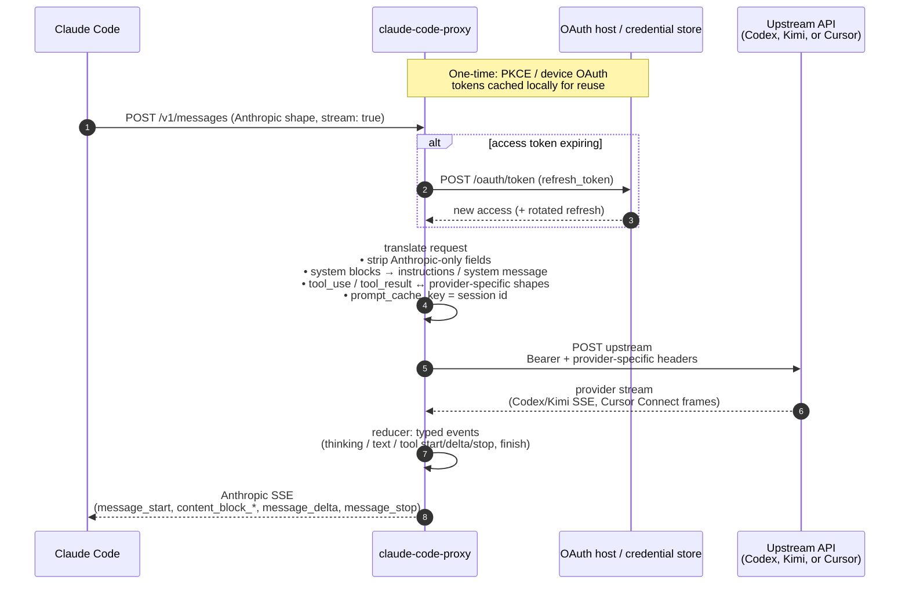

# claude-code-proxy

`claude-code-proxy` lets you use
[Claude Code](https://www.anthropic.com/claude-code) with your **ChatGPT
Plus/Pro** subscription, your **Kimi Code** (kimi.com) account, your **Grok**
subscription, or **Cursor Agent**.


[Quick start](#quick-start) · [Providers](#providers) ·
[How it works](#how-it-works) · [Configuration](#configuration) ·
[Limitations](#limitations)

## Why?

I feel Claude Code is still the best harness around, despite occasional
frustrations caused by updates. However, Anthropic keeps tightening the usage
limits, while OpenAI is still much more generous.

If you want to use OpenAI plans, your best options seem to be OpenCode and
Codex. I tried OpenCode, but the UX has many rough edges, especially around
skills feeling like a second-class feature. Fortunately it's open source and I
ended up forking it and applying some patches, but would much rather not do it.

## Quick start

### 1. Install

**Homebrew** (macOS and Linux):

```sh
brew install raine/claude-code-proxy/claude-code-proxy
```

**Install script** (macOS and Linux):

```sh
curl -fsSL https://raw.githubusercontent.com/raine/claude-code-proxy/main/scripts/install.sh | bash
```

**Manual:** download a prebuilt binary for your platform from the
[releases page](https://github.com/raine/claude-code-proxy/releases). Windows
artifacts are published as `claude-code-proxy-windows-amd64.zip` and
`claude-code-proxy-windows-arm64.zip`; extract the `.exe` somewhere on your
`PATH`.

### 2. Pick a provider and authenticate

The proxy supports four upstream providers. Pick one and run its login flow; the
proxy will refuse to start traffic until a token is stored.

**Codex (ChatGPT Plus/Pro):**

```sh
claude-code-proxy codex auth login     # browser OAuth (PKCE)
# or, on a headless machine:
claude-code-proxy codex auth device    # device-code flow
```

Sign in with your **ChatGPT Plus/Pro account**, not an OpenAI API account.

**Kimi (kimi.com Kimi Code):**

```sh
claude-code-proxy kimi auth login      # device-code flow (prints URL + code)
```

Sign in with your **kimi.com account**. The verification URL is displayed; open
it in any browser, confirm the code, and the CLI polls until done.

**Grok (grok.com):**

```sh
claude-code-proxy grok auth login      # browser OAuth (PKCE)
```

Sign in with your **grok.com account**. The proxy stores and refreshes its own
OAuth session and does not use the official Grok CLI credential file.

**Cursor Agent:**

```sh
claude-code-proxy cursor auth login
claude-code-proxy cursor auth status
```

Cursor authentication uses Cursor's browser login, but the proxy stores its own
tokens. It does not read Cursor Agent's Keychain/auth.json. You can also set
`CCP_CURSOR_AUTH_TOKEN` for the proxy process.

On macOS credentials go to Keychain. On Windows they are written under
`%APPDATA%\claude-code-proxy\<provider>\auth.json`; on Linux they are written
under `${XDG_CONFIG_HOME:-$HOME/.config}/claude-code-proxy/<provider>/auth.json`
(mode 0600 where supported). Set `CCP_CONFIG_DIR` before `cursor auth login` to
store a separate Cursor login at `$CCP_CONFIG_DIR/cursor/auth.json`.

Verify:

```sh
claude-code-proxy codex auth status
claude-code-proxy kimi auth status
claude-code-proxy grok auth status
claude-code-proxy cursor auth status
```

### 3. Start the proxy

```sh
claude-code-proxy serve                # listens on 127.0.0.1:18765
PORT=11435 claude-code-proxy serve     # change the listen port
claude-code-proxy serve --no-monitor   # plain logs instead of the monitor TUI
```

Binds to `127.0.0.1` only. One `serve` process handles all providers — the
upstream for each request is chosen from `ANTHROPIC_MODEL`. When stdout is a
terminal, `serve` opens a monitor TUI with sessions, active requests, recent
requests, and error events. Use `--no-monitor` for plain terminal output.

### 4. Point Claude Code at it

`ANTHROPIC_MODEL` selects the provider:

- `gpt-5.6-sol`, `gpt-5.6-terra`, `gpt-5.6-luna`, `gpt-5.5`, `gpt-5.4`, `gpt-5.3-codex`, `gpt-5.3-codex-spark`, `gpt-5.4-mini`, `gpt-5.2` → **codex**
- `kimi-for-coding`, `kimi-k2.6`, `k2.6` → **kimi**
- `grok-composer-2.5-fast`, `grok-4.5` → **grok**
- `cursor`, `cursor-plan`, `cursor-ask`, `composer-2.5`, `composer-2.5-fast`, `cursor:<model-id>`, `cursor-plan:<model-id>`, `cursor-ask:<model-id>` → **cursor**

An unknown model returns a 400 listing the supported ids. There is no
implicit default provider.

Claude Code also issues background requests (session title generation, token
counts) against its built-in "small/fast" haiku model id. Those requests
would 400 because no provider claims it, so set
`ANTHROPIC_SMALL_FAST_MODEL` to a concrete id too (the same value as
`ANTHROPIC_MODEL` is usually fine):

```sh
# Codex
ANTHROPIC_BASE_URL=http://localhost:18765 \
ANTHROPIC_AUTH_TOKEN=unused \
ANTHROPIC_MODEL=gpt-5.6-sol[1m] \
ANTHROPIC_SMALL_FAST_MODEL=gpt-5.6-luna[1m] \
CLAUDE_CODE_AUTO_COMPACT_WINDOW=372000 \
CLAUDE_CODE_DISABLE_NONESSENTIAL_TRAFFIC=1 \
CLAUDE_CODE_DISABLE_NONSTREAMING_FALLBACK=1 \
  claude

# Kimi
ANTHROPIC_BASE_URL=http://localhost:18765 \
ANTHROPIC_AUTH_TOKEN=unused \
ANTHROPIC_MODEL=kimi-for-coding[1m] \
ANTHROPIC_SMALL_FAST_MODEL=kimi-for-coding[1m] \
CLAUDE_CODE_DISABLE_NONESSENTIAL_TRAFFIC=1 \
CLAUDE_CODE_DISABLE_NONSTREAMING_FALLBACK=1 \
  claude

# Grok
ANTHROPIC_BASE_URL=http://localhost:18765 \
ANTHROPIC_AUTH_TOKEN=unused \
ANTHROPIC_MODEL=grok-composer-2.5-fast \
ANTHROPIC_SMALL_FAST_MODEL=grok-composer-2.5-fast \
CLAUDE_CODE_DISABLE_NONESSENTIAL_TRAFFIC=1 \
CLAUDE_CODE_DISABLE_NONSTREAMING_FALLBACK=1 \
  claude --model grok-composer-2.5-fast

# Cursor Agent
ANTHROPIC_BASE_URL=http://localhost:18765 \
ANTHROPIC_AUTH_TOKEN=unused \
ANTHROPIC_MODEL=cursor \
ANTHROPIC_SMALL_FAST_MODEL=cursor \
CLAUDE_CODE_DISABLE_NONESSENTIAL_TRAFFIC=1 \
CLAUDE_CODE_DISABLE_NONSTREAMING_FALLBACK=1 \
  claude
```

`CLAUDE_CODE_DISABLE_NONSTREAMING_FALLBACK=1` is recommended because the
proxy always talks to upstream providers with streaming requests, even when it
accumulates a non-streaming Anthropic response for Claude Code. Disabling Claude
Code's streaming-to-non-streaming fallback avoids retrying a partially completed
stream in a way that can duplicate tool calls.

Or set it persistently in `~/.claude/settings.json`:

```json
{
  "env": {
    "ANTHROPIC_BASE_URL": "http://127.0.0.1:18765",
    "ANTHROPIC_AUTH_TOKEN": "unused",
    "ANTHROPIC_MODEL": "gpt-5.6-sol[1m]",
    "ANTHROPIC_SMALL_FAST_MODEL": "gpt-5.6-luna[1m]",
    "CLAUDE_CODE_AUTO_COMPACT_WINDOW": 372000,
    "CLAUDE_CODE_DISABLE_NONESSENTIAL_TRAFFIC": 1,
    "CLAUDE_CODE_DISABLE_NONSTREAMING_FALLBACK": 1
  }
}
```

### 5. Context window size

Claude Code decides auto-compaction based on the model's context window. For
unknown models, Claude Code uses its own fallback context size. The `[1m]` suffix
is a local Claude Code hint that raises that compaction threshold. It is useful
only when the upstream model can actually handle a window that large.

Use the `[1m]` suffix for Codex and Kimi models so Claude Code uses a larger
local compaction threshold, such as `gpt-5.6-sol[1m]`, `gpt-5.6-luna[1m]`, or
`kimi-for-coding[1m]`. The proxy strips a trailing `[1m]` before sending the
request upstream. The suffix affects Claude Code's local compaction decision and
does not increase the upstream model's context window.

Official Codex metadata reports the GPT-5.6 Codex models with a 372K-token
window. Set `CLAUDE_CODE_AUTO_COMPACT_WINDOW=372000` with `gpt-5.6-sol[1m]` so
Claude Code does not compact too early, while still compacting before the real
upstream limit.

If you'd rather disable auto-compact completely, set
`DISABLE_AUTO_COMPACT=1` in your env or `~/.claude/settings.json`. Manual
`/compact` still works, but you risk hitting real upstream limits before
Claude Code can compact for you.

## Toggling between proxy and direct Anthropic

If you still have an Anthropic subscription you want to fall back to, you can
put a small wrapper in front of `claude` that only injects the proxy env vars
when a flag file exists, plus a toggle script to flip the flag. Leave
`~/.claude/settings.json` free of proxy env vars so direct-to-Anthropic remains
the default.

`~/.local/bin/claude` (ahead of the real `claude` on `PATH`):

```bash
#!/bin/bash
# Wrapper that optionally routes to claude-code-proxy.
# Active when ~/.claude/claude-code-proxy-enabled exists.

if [ -f "$HOME/.claude/claude-code-proxy-enabled" ]; then
    export ANTHROPIC_BASE_URL="http://localhost:18765"
    export ANTHROPIC_AUTH_TOKEN="unused"
    export ANTHROPIC_MODEL="gpt-5.6-sol[1m]"
    export ANTHROPIC_SMALL_FAST_MODEL="gpt-5.6-luna[1m]"
    export CLAUDE_CODE_AUTO_COMPACT_WINDOW="372000"
    export CLAUDE_CODE_DISABLE_NONESSENTIAL_TRAFFIC="1"
    export CLAUDE_CODE_DISABLE_NONSTREAMING_FALLBACK="1"
fi

exec "$HOME/.local/bin/claude" "$@"
```

Adjust the exec path if the real `claude` binary lives elsewhere on your
system (e.g. `$(bun pm bin -g)/claude`, `$HOME/.claude/local/claude`).

`claude-proxy-toggle` (anywhere on your `PATH`):

```bash
#!/bin/bash
# Toggle claude-code-proxy routing for the claude wrapper.
set -euo pipefail

flag="$HOME/.claude/claude-code-proxy-enabled"

if [ -f "$flag" ]; then
    rm "$flag"
    echo "proxy: off"
else
    mkdir -p "$(dirname "$flag")"
    touch "$flag"
    echo "proxy: on"
fi
```

Run `claude-proxy-toggle` to flip between routing through the proxy (Codex /
Kimi) and talking to Anthropic directly. New or continued `claude` sessions pick up
the change immediately; existing sessions keep whatever they started with.

## Providers

### Codex (ChatGPT)

Upstream: `https://chatgpt.com/backend-api/codex/responses` (Responses API).

Set `ANTHROPIC_MODEL` to a model your ChatGPT subscription is allowed to use.
Append `-fast` to a Codex model name to request Codex fast mode for that request
without restarting the proxy. For example, `gpt-5.6-sol-fast` is sent upstream as
model `gpt-5.6-sol` with `service_tier: "priority"`. An explicit
`codex.serviceTier` / `CCP_CODEX_SERVICE_TIER` override still takes precedence.

Reasoning effort: Claude Code's `output_config.effort` value (the one you see in
the UI as `◐ medium · /effort`) is forwarded as Codex `reasoning.effort` (`low`
/ `medium` / `high` / `xhigh` / `max`). An explicit `codex.effort` /
`CCP_CODEX_EFFORT` override still takes precedence and can also force `none`.

Reasoning summaries: when a Codex request has reasoning effort, the proxy asks
Codex for `reasoning.summary: "auto"` and translates returned summary deltas
into Anthropic `thinking` content blocks. Codex decides when a summary is useful,
so simple prompts can emit no thinking block. Set `codex.reasoningSummary` /
`CCP_CODEX_REASONING_SUMMARY` to `off` or `none` to suppress summaries while
keeping `reasoning.effort` and encrypted continuation content.

Claude Code's hosted `web_search_20250305` tool is translated to Codex's native
Responses `web_search` tool, including non-empty domain filters. Codex hosted
search calls are emitted back to Claude Code as Anthropic `server_tool_use` and
`web_search_tool_result` blocks with `usage.server_tool_use.web_search_requests`
so Claude Code can account for completed searches.

Confirmed working on **Plus**:

- `gpt-5.4`
- `gpt-5.3-codex`

Also verified:

- `gpt-5.2`
- `gpt-5.4-mini`

If the resolved model isn't supported by your account, upstream returns a 400
like
`"The 'gpt-4.1' model is not supported when using Codex with a ChatGPT account."`.
The proxy surfaces that verbatim.

Auth:

| Command             | What it does                               |
| ------------------- | ------------------------------------------ |
| `codex auth login`  | Browser OAuth (PKCE) via `auth.openai.com` |
| `codex auth device` | Device-code OAuth for headless machines    |
| `codex auth status` | Show account ID + token expiry             |
| `codex auth logout` | Delete stored credentials                  |

### Kimi (Kimi Code)

Upstream: `https://api.kimi.com/coding/v1/chat/completions` (OpenAI-style
chat-completions).

Only one wire model is exposed: `kimi-for-coding` (its display name in kimi-cli
is **Kimi-k2.6**, 256k context, supports reasoning + image input + video input).
`kimi-k2.6` and `k2.6` are accepted as aliases for the same wire id.

Reasoning effort: Claude Code's `output_config.effort` value (the one you see in
the UI as `◐ medium · /effort`) is forwarded as Kimi's `reasoning_effort` (`low`
/ `medium` / `high`). Thinking blocks from the upstream model are forwarded to
Claude Code and rendered as thinking content. If Claude Code disables thinking,
the proxy drops both `reasoning_effort` and the `thinking: {type: "enabled"}`
flag before forwarding.

Auth:

| Command            | What it does                          |
| ------------------ | ------------------------------------- |
| `kimi auth login`  | Device-code OAuth via `auth.kimi.com` |
| `kimi auth status` | Show user ID + token expiry           |
| `kimi auth logout` | Delete stored credentials             |

### Grok

Upstream: `https://cli-chat-proxy.grok.com/v1/responses` (Responses API).

Supported model ids are `grok-composer-2.5-fast` and `grok-4.5`. Model access
can vary by account and region. The proxy translates Claude Code messages,
function tools, tool results, thinking, token counts, and streaming events.
Grok reasoning text appears in Claude Code as Anthropic `thinking` blocks.
Claude Code's `WebSearch` uses Grok's hosted general web search. Requests to
search X use Grok's hosted `x_search` tool, with citations and search usage
reported in Claude Code.

Authentication uses browser OAuth with S256 PKCE through `auth.x.ai` and an
ephemeral loopback callback. The proxy stores its own access and refresh tokens,
refreshes them five minutes before expiry, and does not use `~/.grok/auth.json`.

| Command            | What it does                        |
| ------------------ | ----------------------------------- |
| `grok auth login`  | Browser OAuth with a local callback |
| `grok auth status` | Show token expiry and storage path  |
| `grok auth logout` | Delete proxy-owned credentials      |

### Cursor Agent

Upstream: `https://api2.cursor.sh/agent.v1.AgentService/Run` (Cursor Agent's
HTTP/2 full-duplex Connect protocol). The captured HTTP/1 fallback is
`RunSSE` plus `/aiserver.v1.BidiService/BidiAppend`; the provider now uses the
primary HTTP/2 stream.

Supported proxy model ids:

- `cursor`, `cursor-agent`: Cursor default model selection
- `cursor-plan`: Cursor default model selection with `AGENT_MODE_PLAN`
- `cursor-ask`: Cursor default model selection with `AGENT_MODE_ASK`
- `cursor-composer`, `composer-2.5`: Cursor Composer 2.5
- `cursor-composer-fast`, `composer-2.5-fast`: Cursor Composer 2.5 fast mode
- `cursor:<model-id>`: force any Cursor Agent model id through Cursor
- `cursor-plan:<model-id>`: same model with Cursor `AGENT_MODE_PLAN`
- `cursor-ask:<model-id>`: same model with Cursor `AGENT_MODE_ASK`

The prefixed forms are the recommended way to select Cursor's full model
catalog. They avoid collisions with other proxy providers, for example
`gpt-5.2` can remain a Codex model while `cursor:gpt-5.2` forces Cursor.
The catalog advertised by `/v1/models` is generated from
`cursor-agent --list-models`; unknown future ids are still accepted with
`cursor:<raw-model>`.

Claude Code's `/effort` setting is mapped onto Cursor catalog ids when the
selected Cursor model exposes matching effort variants. For example,
`ANTHROPIC_MODEL=cursor:gpt-5.5` plus `/effort high` requests
`gpt-5.5-high`, while `/effort max` picks the strongest available catalog
variant such as `xhigh`, `extra-high`, or `high`. Explicit effort model ids
such as `cursor:gpt-5.5-low` are respected as-is, `-fast` is preserved when
available, and models without effort variants (for example
`cursor:gemini-3.1-pro` in the captured catalog) are left unchanged.

Plan mode can also be selected per request with metadata:

```json
{
  "metadata": {
    "cursor_mode": "plan"
  }
}
```

Cursor continuation maps Claude Code's `x-claude-code-session-id` to a Cursor
conversation id in memory. To resume an existing Cursor chat explicitly, set
`metadata.cursor_chat_id`, `metadata.cursorChatId`, `metadata.cursor_resume`, or
`metadata.cursorResume` to the Cursor chat id. The observed Cursor session id is
recorded back into the session map when Cursor returns it.

Auth:

| Command              | What it does                                                |
| -------------------- | ----------------------------------------------------------- |
| `cursor auth login`  | Browser login and proxy-owned Cursor token storage          |
| `cursor auth status` | Shows proxy-owned Cursor credential source and token expiry |
| `cursor auth logout` | Clears proxy-owned Cursor credentials                       |

## How it works



## Commands

| Command                                             | Description                 |
| --------------------------------------------------- | --------------------------- |
| [`serve`](#serve)                                   | Start the proxy and monitor |
| `codex auth login` / `device` / `status` / `logout` | Codex OAuth management      |
| `kimi  auth login` / `status` / `logout`            | Kimi OAuth management       |
| `cursor auth login` / `status` / `logout`           | Cursor OAuth management     |

---

### `serve`

Starts the HTTP proxy and blocks. Binds to `127.0.0.1` only. When stdout is a
terminal, `serve` opens a monitor TUI showing sessions, active requests, recent
requests, token throughput, and error events. Use `--no-monitor` to run with
plain terminal output.

Logs are written to the platform state directory and rotated at 20 MiB. Set
`CCP_LOG_STDERR=1` to mirror log lines to stderr while running without the
monitor.

```sh
claude-code-proxy serve
PORT=11435 claude-code-proxy serve
claude-code-proxy serve --no-monitor
CCP_LOG_STDERR=1 claude-code-proxy serve --no-monitor
```

The plain server banner prints the supported model to provider mapping on
startup. One `serve` process dispatches to any provider based on the `model`
field in each request. Requests whose model isn't registered with any provider
are rejected with HTTP 400 listing the supported ids.

---

### Codex auth commands

#### `codex auth login`

Runs the PKCE browser flow against `auth.openai.com` using the Codex CLI's
client ID. Prints a URL, opens a local callback listener on port 1455, waits for
the browser to redirect back, and stores the resulting access / refresh tokens
in Keychain on macOS or locally on other platforms. The process exits
automatically once the tokens are saved.

```sh
claude-code-proxy codex auth login
```

Sign in with your **ChatGPT Plus/Pro account**, not an OpenAI API account. The
token file includes the extracted `chatgpt_account_id` so the proxy can set the
`ChatGPT-Account-Id` header on every upstream call.

#### `codex auth device`

Same OAuth flow, but for headless machines. Prints a short user code and a URL;
you enter the code from any browser on any other device, and the CLI polls
`auth.openai.com` until you authorize, then stores the token.

```sh
claude-code-proxy codex auth device
```

Useful over SSH, inside a container, or on any host that can't open a browser.

#### `codex auth status`

Shows whether credentials are stored, the account ID, and how long until the
access token expires. Non-zero exit if no auth is present.

```sh
claude-code-proxy codex auth status
```

Example output:

```
Account: 79342a5e-57b7-44ea-bfdc-a83ba070dad6
Expires: 2026-04-28T16:46:04.827Z (in 863946s)
Storage: macOS Keychain
```

The proxy refreshes the access token 5 minutes before expiry with a
single-flight guard, so concurrent requests never trigger stampedes of refresh
calls.

#### `codex auth logout`

Removes stored auth credentials. On macOS this deletes the Keychain entry. No
server call is needed; the refresh token just becomes dead.

```sh
claude-code-proxy codex auth logout
```

Run `codex auth login` again to re-authenticate.

---

### Kimi auth commands

#### `kimi auth login`

Runs a device-code OAuth flow (RFC 8628) against `auth.kimi.com` using the
kimi-cli client ID. Prints a verification URL and a short user code; open the
URL in any browser, confirm the code, and the CLI polls until the tokens are
issued. Tokens are stored in Keychain on macOS or a mode-0600 file elsewhere.

```sh
claude-code-proxy kimi auth login
```

Sign in with your **kimi.com account**. The access token has a ~15 minute
lifetime; the proxy refreshes it 5 minutes before expiry with a single-flight
guard and persists the rotated refresh token.

A persistent device ID is generated on first login next to the Kimi auth file
and reused forever — it's bound into the issued JWT, so rotating it would
invalidate your token.

#### `kimi auth status`

```sh
claude-code-proxy kimi auth status
```

Shows the user ID extracted from the token, expiry time, scope, and storage
backend. Non-zero exit if no auth is present.

#### `kimi auth logout`

```sh
claude-code-proxy kimi auth logout
```

Removes stored auth credentials (Keychain entry on macOS, file elsewhere). Run
`kimi auth login` again to re-authenticate.

---

### Cursor auth commands

#### `cursor auth login`

```sh
claude-code-proxy cursor auth login
```

Starts Cursor's browser login flow, polls `api2.cursor.sh/auth/poll`, and
stores the resulting Cursor access/refresh tokens in the proxy's own auth
store. The proxy does not read or write Cursor Agent's Keychain/auth.json.

#### `cursor auth status`

```sh
claude-code-proxy cursor auth status
```

Shows whether Cursor credentials were discovered, the source, user/email claims
when present, and token expiry. Non-zero exit if no auth is present.

#### `cursor auth logout`

```sh
claude-code-proxy cursor auth logout
```

Clears Cursor credentials from the discovered local auth store. Run
`claude-code-proxy cursor auth login` again to re-authenticate.

---

### Endpoints

The proxy speaks enough of the Anthropic API for Claude Code:

- `POST /v1/messages`: the main turn endpoint (streaming and non-streaming)
- `POST /v1/messages?beta=true`: same (Claude Code always sends `?beta=true`)
- `POST /v1/messages/count_tokens`: local token count via `gpt-tokenizer`
  (o200k_base); used by Claude Code's compaction logic
- `GET /healthz`: liveness check

## Configuration

Settings can come from either environment variables or a `config.json` file.
Precedence per setting: **env var > config file > built-in default**. The
config file is optional — env-var-only setups continue to work unchanged.

The file lives at `~/.config/claude-code-proxy/config.json` on macOS
(deliberately not `~/Library`), at `%APPDATA%\claude-code-proxy\config.json` on
Windows, and at
`${XDG_CONFIG_HOME:-$HOME/.config}/claude-code-proxy/config.json` on Linux. Set
`CCP_CONFIG_DIR` to use a separate config and auth directory for that process.

```json
{
  "port": 18765,
  "aliasProvider": "codex",
  "codex": {
    "originator": "claude-code-proxy",
    "userAgent": "claude-code-proxy/dev",
    "model": "gpt-5.4",
    "effort": "medium",
    "reasoningSummary": "auto",
    "serviceTier": "fast",
    "baseUrl": "https://chatgpt.com/backend-api/codex/responses",
    "transport": "websocket",
    "previousResponseId": false
  },
  "kimi": {
    "userAgent": "KimiCLI/1.37.0",
    "oauthHost": "https://auth.kimi.com",
    "baseUrl": "https://api.kimi.com/coding/v1"
  },
  "grok": {
    "baseUrl": "https://cli-chat-proxy.grok.com/v1",
    "clientVersion": "0.2.93"
  },
  "cursor": {
    "baseUrl": "https://api2.cursor.sh",
    "clientVersion": "cli-2026.06.04-5fd875e",
    "agentBundle": "/path/to/cursor-agent/index.js"
  },
  "log": {
    "stderr": false,
    "verbose": false
  }
}
```

| Variable                         | Config key                 | Default                                           | Purpose                                                                                                                                                                           |
| -------------------------------- | -------------------------- | ------------------------------------------------- | --------------------------------------------------------------------------------------------------------------------------------------------------------------------------------- |
| `PORT`                           | `port`                     | `18765`                                           | Proxy listen port                                                                                                                                                                 |
| `CCP_CONFIG_DIR`                 | unset                      | platform config dir                               | Per-process config directory; Cursor auth uses it for file storage                                                                                                                |
| `XDG_STATE_HOME`                 | —                          | `~/.local/state`                                  | Linux/macOS base dir for `proxy.log`                                                                                                                                              |
| `CCP_LOG_STDERR`                 | `log.stderr`               | unset                                             | Also mirror log lines to stderr; any env value enables it                                                                                                                         |
| `CCP_LOG_VERBOSE`                | `log.verbose`              | unset                                             | Preserve full string fields in `proxy.log`; any env value enables it                                                                                                              |
| `CCP_TRAFFIC_LOG`                | —                          | unset                                             | Write full per-request traffic captures under `traffic/` for session debugging (`1`, `true`, or `yes`)                                                                            |
| `CCP_ALIAS_PROVIDER`             | `aliasProvider`            | `codex`                                           | Route Anthropic-style aliases (`haiku`, `sonnet`, `opus`, `claude-*`) through `codex` or `kimi`                                                                                   |
| `CCP_KIMI_OAUTH_HOST`            | `kimi.oauthHost`           | `https://auth.kimi.com`                           | Override Kimi's OAuth host (debugging only)                                                                                                                                       |
| `CCP_KIMI_BASE_URL`              | `kimi.baseUrl`             | `https://api.kimi.com/coding/v1`                  | Override Kimi's API base URL                                                                                                                                                      |
| `CCP_CODEX_MODEL`                | `codex.model`              | unset                                             | Force all Codex requests to this model (`gpt-5.2`, `gpt-5.3-codex`, `gpt-5.3-codex-spark`, `gpt-5.4`, `gpt-5.4-mini`, `gpt-5.5`, `gpt-5.6-luna`, `gpt-5.6-sol`, `gpt-5.6-iterra`) |
| `CCP_CODEX_EFFORT`               | `codex.effort`             | unset                                             | Force all Codex requests to this reasoning effort (`none`, `low`, `medium`, `high`, `xhigh`, `max`)                                                                               |
| `CCP_CODEX_REASONING_SUMMARY`    | `codex.reasoningSummary`   | unset                                             | Request Codex reasoning summaries when reasoning effort is enabled; `off` and `none` suppress summaries                                                                           |
| `CCP_CODEX_SERVICE_TIER`         | `codex.serviceTier`        | unset                                             | Force all Codex requests to this service tier (`fast`/`priority`, `flex`; `fast` is sent upstream as `priority`)                                                                  |
| `CCP_CODEX_BASE_URL`             | `codex.baseUrl`            | `https://chatgpt.com/backend-api/codex/responses` | Override the Codex Responses endpoint                                                                                                                                             |
| `CCP_CODEX_TRANSPORT`            | `codex.transport`          | `websocket`                                       | Codex transport: `websocket`, `http`, or `auto`                                                                                                                                   |
| `CCP_CODEX_PREVIOUS_RESPONSE_ID` | `codex.previousResponseId` | `false`                                           | Enable WebSocket continuation with `previous_response_id` when the request is append-only                                                                                         |
| `CCP_CODEX_ORIGINATOR`           | `codex.originator`         | `claude-code-proxy`                               | Override the `originator` header sent to Codex                                                                                                                                    |
| `CCP_CODEX_USER_AGENT`           | `codex.userAgent`          | `claude-code-proxy/<version>`                     | Override the `User-Agent` header sent to Codex                                                                                                                                    |
| `CCP_KIMI_USER_AGENT`            | `kimi.userAgent`           | `KimiCLI/1.37.0`                                  | Override the `User-Agent` header sent to Kimi                                                                                                                                     |
| `CCP_GROK_BASE_URL`              | `grok.baseUrl`             | `https://cli-chat-proxy.grok.com/v1`              | Override the Grok Responses API base URL                                                                                                                                          |
| `CCP_GROK_CLIENT_VERSION`        | `grok.clientVersion`       | `0.2.93`                                          | Override the Grok client version header                                                                                                                                           |
| `CCP_CURSOR_BASE_URL`            | `cursor.baseUrl`           | `https://api2.cursor.sh`                          | Override Cursor's API base URL                                                                                                                                                    |
| `CCP_CURSOR_CLIENT_VERSION`      | `cursor.clientVersion`     | `cli-2026.06.04-5fd875e`                          | Override Cursor client version headers                                                                                                                                            |
| `CCP_CURSOR_AGENT_BUNDLE`        | `cursor.agentBundle`       | auto-detected                                     | Path to Cursor Agent's bundled `index.js` used only for protobuf schemas                                                                                                          |
| `CCP_CURSOR_AUTH_TOKEN`          | —                          | unset                                             | Use this Cursor bearer token instead of local claude-code-proxy Cursor auth storage                                                                                               |
| `CCP_ORIGINATOR`                 | —                          | `claude-code-proxy`                               | Fallback for `CCP_CODEX_ORIGINATOR`                                                                                                                                               |
| `CCP_USER_AGENT`                 | —                          | unset                                             | Fallback for `CCP_CODEX_USER_AGENT` and `CCP_KIMI_USER_AGENT`                                                                                                                     |

A malformed `config.json` is reported on stderr and ignored; defaults are used
in its place. Invalid types for individual keys are warned and skipped without
affecting other keys.

Codex uses the WebSocket Responses transport by default. Set
`CCP_CODEX_TRANSPORT=http` to use the older HTTP SSE transport for debugging or
compatibility, or `CCP_CODEX_TRANSPORT=auto` to try WebSocket with HTTP fallback
only when setup fails before a request is sent upstream.
`CCP_CODEX_PREVIOUS_RESPONSE_ID=1` enables opt-in WebSocket continuation for
append-only turns. Continuation keeps in-memory state keyed by Claude Code
session id, reuses a session WebSocket while it remains open, and sends
`previous_response_id` only when the translated request shape is unchanged and
the new input strictly extends the previous transcript. On mismatch, missing
state, missing upstream response, closed connections, or setup failure, the
proxy clears unsafe continuation state and sends the full request instead.
Continuation reduces repeated request upload size, but it does not increase the
upstream model context window. Multi-process or load-balanced deployments need
sticky sessions or shared state before enabling continuation.

### Files

- `proxy.log` — JSON-lines log, rotated at 20 MiB. It lives at
  `$XDG_STATE_HOME/claude-code-proxy/proxy.log` on macOS/Linux and at
  `%LOCALAPPDATA%\claude-code-proxy\proxy.log` on Windows (falling back to
  `%USERPROFILE%\AppData\Local`). Secrets (`authorization`, `access`,
  `refresh`, `id_token`, `ChatGPT-Account-Id`, …) are redacted before write.
- `errors/` - failed proxy responses captured as JSON files under the state
  directory. `request_failed` log lines include an `errorFile` path for copying
  the complete redacted error payload into debugging notes or an AI prompt.
- `traffic/` — per-request captures written when `CCP_TRAFFIC_LOG=1` is set.
  Captures live under the state directory, grouped by Claude Code session and
  request sequence. They include inbound Anthropic requests, translated upstream
  requests, upstream headers, upstream events, and downstream events. Stream
  events are written under each request's `events/` directory with monotonic
  sequence numbers so sorted filenames preserve emission order. Token and
  account headers are redacted, but prompt and tool content are intentionally
  preserved for debugging.
  For the most complete debugging run, use `CCP_LOG_STDERR=1 CCP_LOG_VERBOSE=1
CCP_TRAFFIC_LOG=1`.
- `config.json` — optional configuration file (see table above). It lives at
  `~/.config/claude-code-proxy/config.json` on macOS,
  `${XDG_CONFIG_HOME:-$HOME/.config}/claude-code-proxy/config.json` on Linux,
  and `%APPDATA%\claude-code-proxy\config.json` on Windows. `CCP_CONFIG_DIR`
  replaces the platform config directory for the current process.
- Codex tokens — macOS uses Keychain under service `claude-code-proxy.codex`.
  Linux uses
  `${XDG_CONFIG_HOME:-$HOME/.config}/claude-code-proxy/codex/auth.json`.
  Windows uses `%APPDATA%\claude-code-proxy\codex\auth.json`.
- Kimi tokens — macOS uses Keychain under service `claude-code-proxy.kimi`.
  Linux uses
  `${XDG_CONFIG_HOME:-$HOME/.config}/claude-code-proxy/kimi/auth.json`.
  Windows uses `%APPDATA%\claude-code-proxy\kimi\auth.json`.
- Kimi device ID — persistent UUID bound into the Kimi JWT at login. Linux uses
  `${XDG_CONFIG_HOME:-$HOME/.config}/claude-code-proxy/kimi/device_id`; Windows
  uses `%APPDATA%\claude-code-proxy\kimi\device_id`. Reused for the lifetime
  of the install.
- Cursor tokens — macOS uses Keychain under service
  `claude-code-proxy.cursor`. Linux uses
  `${XDG_CONFIG_HOME:-$HOME/.config}/claude-code-proxy/cursor/auth.json`.
  Windows uses `%APPDATA%\claude-code-proxy\cursor\auth.json`. When
  `CCP_CONFIG_DIR` is set, Cursor tokens are written to `cursor/auth.json` under
  that directory, including on macOS.
  `CCP_CURSOR_AUTH_TOKEN` overrides local proxy-owned storage.

## Limitations

- **Terms of service:** using the Codex, Kimi, or Cursor backends from a non-official
  client is a gray area. Use at your own risk.
- **Rate limits:** shared across all clients of your upstream account. Codex's
  `codex.rate_limits.limit_reached` and Kimi's HTTP 429 are both surfaced as
  HTTP 429 with `retry-after`.
- **Codex — image inputs in tool results:** Responses API `function_call_output`
  only takes a string, so image blocks nested inside `tool_result` are replaced
  with a `[image omitted: <media_type>]` placeholder. Top-level user-message
  images pass through.
- **Kimi — image inputs in tool results:** pass through as `image_url` parts
  (Kimi accepts them in `role:"tool"` content).
- **Codex — reasoning blocks:** not forwarded to Claude Code (dropped), even if
  the upstream model produced them.
- **Kimi — reasoning blocks:** forwarded as Anthropic `thinking` content blocks
  and rendered by Claude Code. Disable by setting
  `thinking: {"type":"disabled"}` in your Anthropic request.
- **Session title generation:** Claude Code's parallel title-gen request is
  forwarded upstream like any other structured-output request. This costs a
  handful of tokens per session rather than being stubbed.
- **Codex — `output_config.format`:** translated to Responses API `text.format`
  (json_schema with `strict: true`); other Anthropic-specific `output_config`
  fields are dropped.
- **Cursor — protobuf bundle dependency:** the provider speaks Cursor's
  underlying protocol directly, but reuses the installed Cursor Agent bundle's
  generated protobuf classes. Set `CCP_CURSOR_AGENT_BUNDLE` if auto-detection
  cannot find `cursor-agent`.
- **Cursor — tool round-trips:** text, thinking, plan mode, ask mode, auth, and
  session continuation are implemented. Full Cursor workspace/tool callbacks are
  captured and documented under `history/`, but not yet implemented as Claude
  tool round-trips.

## Development

```sh
cargo run -- serve                         # run locally (routes all providers)
cargo test --all                           # run tests
cargo fmt --all --check                    # check formatting
cargo clippy --all-targets -- -D warnings  # lint
just check                                 # run the full project check
```

## Related projects

- [claude-history](https://github.com/raine/claude-history): search Claude Code
  conversation history from the terminal
- [git-surgeon](https://github.com/raine/git-surgeon): non-interactive
  hunk-level git staging for AI agents
- [workmux](https://github.com/raine/workmux): manage parallel AI coding tasks
  in separate git worktrees with tmux
- [consult-llm](https://github.com/raine/consult-llm): Consult other AI models
  from your agent workflow
