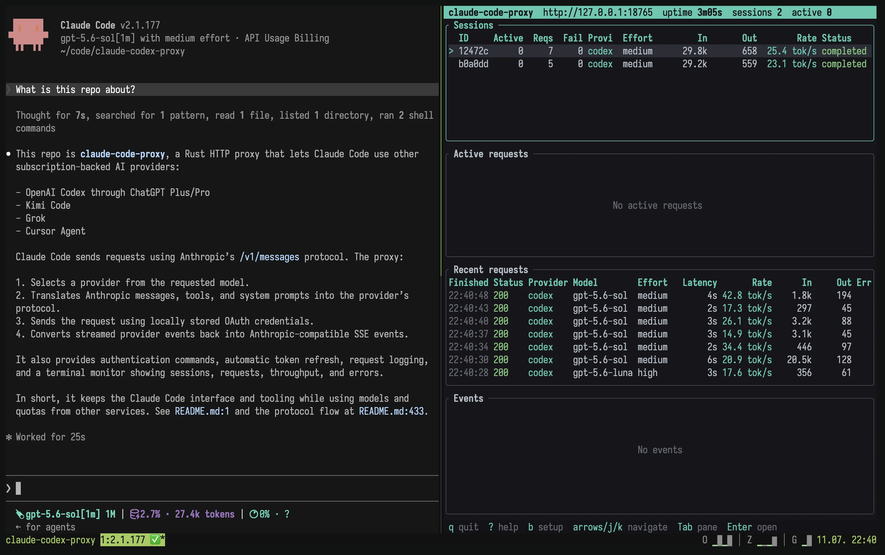
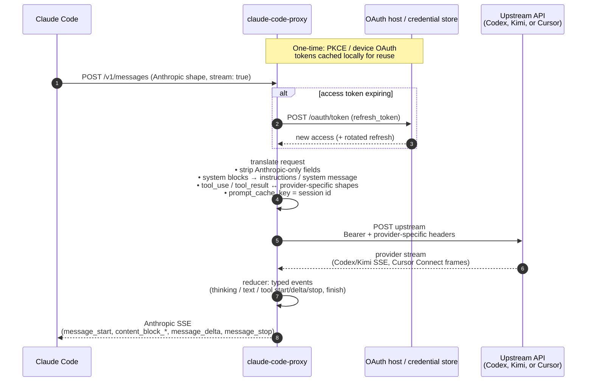

# claude-code-proxy

Claude Code, powered by **OpenAI**, **Kimi**, **Grok**, or **Cursor**.



[Quick start](#quick-start) · [Providers](#providers) ·
[How it works](#how-it-works) · [Configuration](#configuration) ·
[Switching models](#switching-models-and-backends) · [Limitations](#limitations)

## Why?

I feel Claude Code is still the best harness around, despite occasional
frustrations caused by updates. However, Anthropic keeps tightening the usage
limits, while OpenAI is still much more generous.

If you want to use OpenAI plans, your best options seem to be OpenCode and
Codex. I tried OpenCode, but the UX has many rough edges, especially around
skills feeling like a second-class feature. Fortunately it's open source and I
ended up forking it and applying some patches, but would much rather not do it.

## Quick start

### 1. Install

**Install script** (macOS and Linux):

```sh
curl -fsSL https://raw.githubusercontent.com/xiaodream551-a11y/claude-code-proxy/main/scripts/install.sh | bash
```

For a high-assurance install, first install and authenticate the GitHub CLI,
then require both the immutable-release attestation and the build-workflow
attestation:

```sh
curl -fsSL https://raw.githubusercontent.com/xiaodream551-a11y/claude-code-proxy/main/scripts/install.sh -o /tmp/ccproxy-install.sh
CLAUDE_CODE_PROXY_REQUIRE_ATTESTATION=1 bash /tmp/ccproxy-install.sh
```

**Manual:** download a prebuilt binary for your platform from the
[releases page](https://github.com/xiaodream551-a11y/claude-code-proxy/releases). Windows
artifacts are published as `claude-code-proxy-windows-amd64.zip` and
`claude-code-proxy-windows-arm64.zip`; extract the `.exe` somewhere on your
`PATH`.

### 2. Pick a provider and authenticate

The proxy supports four upstream providers. Pick one and run its login flow; the
proxy will refuse to start traffic until a token is stored.

**Codex (ChatGPT Plus/Pro):**

```sh
claude-code-proxy codex auth login     # browser OAuth (PKCE)
# or, on a headless machine:
claude-code-proxy codex auth device    # device-code flow
```

Sign in with your **ChatGPT Plus/Pro account**, not an OpenAI API account.

**Kimi (kimi.com Kimi Code):**

```sh
claude-code-proxy kimi auth login      # device-code flow (prints URL + code)
```

Sign in with your **kimi.com account**. The verification URL is displayed; open
it in any browser, confirm the code, and the CLI polls until done.

**Grok (grok.com):**

```sh
claude-code-proxy grok auth login      # browser OAuth (PKCE)
# or, on a headless machine:
claude-code-proxy grok auth device     # device-code flow (prints URL + code)
```

Sign in with your **grok.com account**. The proxy stores and refreshes its own
OAuth session and does not use the official Grok CLI credential file. On a
headless host, `grok auth device` prints a verification URL and code to enter on
any other device, then polls until authorization completes.

**Cursor Agent:**

```sh
claude-code-proxy cursor auth login
claude-code-proxy cursor auth status
```

Cursor authentication uses Cursor's browser login, but the proxy stores its own
tokens. It does not read Cursor Agent's Keychain/auth.json. You can also set
`CCP_CURSOR_AUTH_TOKEN` for the proxy process.

Codex and Cursor prefer macOS Keychain, but fall back to a mode-0600 provider
file when non-interactive Keychain writes are unavailable; auth commands report
the backend actually in use. Kimi and Grok use provider files on every platform.
Windows stores them under `%APPDATA%\claude-code-proxy\<provider>\auth.json`;
Linux and macOS file fallbacks use
`${XDG_CONFIG_HOME:-$HOME/.config}/claude-code-proxy/<provider>/auth.json`.
Set `CCP_CONFIG_DIR` before `cursor auth login` to store a separate Cursor login
at `$CCP_CONFIG_DIR/cursor/auth.json`.

Verify:

```sh
claude-code-proxy codex auth status
claude-code-proxy kimi auth status
claude-code-proxy grok auth status
claude-code-proxy cursor auth status
```

### 3. Start the proxy

```sh
claude-code-proxy serve                # listens on 127.0.0.1:18765
PORT=11435 claude-code-proxy serve     # change the listen port
CCP_BIND_ADDRESS=0.0.0.0 claude-code-proxy serve  # change the bind address
claude-code-proxy serve --no-monitor   # plain logs instead of the monitor TUI
```

Binds to `127.0.0.1` by default. One `serve` process handles all providers —
the upstream for each request is chosen from `ANTHROPIC_MODEL`. When stdout is
a terminal, `serve` opens a monitor TUI with sessions, active requests, recent
requests, and error events. Use `--no-monitor` for plain terminal output.
The proxy does not authenticate incoming clients, so protect any non-loopback
binding with a firewall or an authenticating reverse proxy.

To explore every monitor pane and interaction without starting the proxy, launch
its deterministic simulated traffic:

```sh
claude-code-proxy demo
```

Resize the terminal to exercise the responsive request table. Press `?` for all
shortcuts, `Enter` for session and request details, and `b` for the setup overlay.

Installed via Homebrew, the proxy can also run as a background service that
starts at login and restarts if it exits:

```sh
brew services start claude-code-proxy
```

Service output goes to `~/.local/state/claude-code-proxy/service.log`,
alongside the proxy's own `proxy.log`. Provider logins are still a one-time
interactive step (e.g. `claude-code-proxy codex auth login`); the service
serves 401s until a token is stored.

When testing changes from a source checkout against that Homebrew service, use
`just deploy-homebrew`. It builds the release binary, backs up the active Cellar
binary, replaces it atomically, restarts the service, and verifies the new PID,
embedded Git SHA, clean-build flag, executable path, and runtime binary SHA. It
refuses a dirty worktree, recovers stale deployment locks, and verifies the old
running image by SHA even when that version predates `/version`. Failures and
termination signals restore and restart the backup. The default health URL uses
`PORT` (or 18765); an explicit `CCP_DEPLOY_HEALTH_URL` must end in `/healthz`.
`just install` targets Cargo's bin directory and does not replace the binary used
by the Homebrew launch service.

### 4. Point Claude Code at it

`ANTHROPIC_MODEL` selects the provider:

- `gpt-5.6-sol`, `gpt-5.6-terra`, `gpt-5.6-luna`, `gpt-5.5`, `gpt-5.4`, `gpt-5.3-codex`, `gpt-5.3-codex-spark`, `gpt-5.4-mini`, `gpt-5.2` → **codex**
- `kimi-for-coding`, `kimi-k2.6`, `k2.6` → **kimi**
- `grok-composer-2.5-fast`, `grok-4.5`, `grok-4.5-medium`, `grok-4.5-high` → **grok**
- `cursor`, `cursor-plan`, `cursor-ask`, `composer-2.5`, `composer-2.5-fast`, `cursor:<model-id>`, `cursor-plan:<model-id>`, `cursor-ask:<model-id>` → **cursor**

An unknown model returns a 400 listing the supported ids. There is no
implicit default provider.

Claude Code also issues background requests (session title generation, token
counts) against its built-in "small/fast" haiku model id. Those requests
would 400 because no provider claims it, so set
`ANTHROPIC_DEFAULT_HAIKU_MODEL` to a concrete id too. Claude Code 2.1.212 still
prefers its deprecated `ANTHROPIC_SMALL_FAST_MODEL` variable when both are set,
so gateways supporting that version should set both to the same value:

```sh
# Codex
ANTHROPIC_BASE_URL=http://localhost:18765 \
ANTHROPIC_AUTH_TOKEN=unused \
ANTHROPIC_MODEL=gpt-5.6-sol \
ANTHROPIC_DEFAULT_HAIKU_MODEL=gpt-5.6-luna \
ANTHROPIC_SMALL_FAST_MODEL=gpt-5.6-luna \
CLAUDE_CODE_MAX_CONTEXT_TOKENS=372000 \
CLAUDE_CODE_AUTO_COMPACT_WINDOW=372000 \
CLAUDE_AUTOCOMPACT_PCT_OVERRIDE=90 \
CLAUDE_CODE_DISABLE_NONSTREAMING_FALLBACK=1 \
  claude

# Kimi
ANTHROPIC_BASE_URL=http://localhost:18765 \
ANTHROPIC_AUTH_TOKEN=unused \
ANTHROPIC_MODEL=kimi-for-coding[1m] \
ANTHROPIC_SMALL_FAST_MODEL=kimi-for-coding[1m] \
CLAUDE_CODE_DISABLE_NONESSENTIAL_TRAFFIC=1 \
CLAUDE_CODE_DISABLE_NONSTREAMING_FALLBACK=1 \
  claude

# Grok
ANTHROPIC_BASE_URL=http://localhost:18765 \
ANTHROPIC_AUTH_TOKEN=unused \
ANTHROPIC_MODEL=grok-composer-2.5-fast \
ANTHROPIC_SMALL_FAST_MODEL=grok-composer-2.5-fast \
CLAUDE_CODE_DISABLE_NONESSENTIAL_TRAFFIC=1 \
CLAUDE_CODE_DISABLE_NONSTREAMING_FALLBACK=1 \
  claude --model grok-composer-2.5-fast

# Cursor Agent
ANTHROPIC_BASE_URL=http://localhost:18765 \
ANTHROPIC_AUTH_TOKEN=unused \
ANTHROPIC_MODEL=cursor \
ANTHROPIC_SMALL_FAST_MODEL=cursor \
CLAUDE_CODE_DISABLE_NONESSENTIAL_TRAFFIC=1 \
CLAUDE_CODE_DISABLE_NONSTREAMING_FALLBACK=1 \
  claude
```

Claude Code sends automatic and manual compaction with the main-loop model. To
route only its recognized compaction summary request to another proxy model,
add a custom header to the Claude Code environment:

```sh
ANTHROPIC_CUSTOM_HEADERS='x-ccproxy-compaction-model: grok-4.5-high'
```

The header is ignored for ordinary prompts. An unknown override model returns
400 instead of silently falling back.

`CLAUDE_CODE_DISABLE_NONSTREAMING_FALLBACK=1` is recommended because the
proxy always talks to upstream providers with streaming requests, even when it
accumulates a non-streaming Anthropic response for Claude Code. Disabling Claude
Code's streaming-to-non-streaming fallback avoids retrying a partially completed
stream in a way that can duplicate tool calls.

If the proxy is your everyday default and you rarely need native Anthropic in
the same Claude config, put the env in `~/.claude/settings.json`:

```json
{
  "env": {
    "ANTHROPIC_BASE_URL": "http://127.0.0.1:18765",
    "ANTHROPIC_AUTH_TOKEN": "unused",
    "ANTHROPIC_MODEL": "gpt-5.6-sol",
    "ANTHROPIC_SMALL_FAST_MODEL": "gpt-5.6-luna",
    "CLAUDE_CODE_MAX_CONTEXT_TOKENS": "372000",
    "CLAUDE_CODE_AUTO_COMPACT_WINDOW": "372000",
    "CLAUDE_AUTOCOMPACT_PCT_OVERRIDE": "90",
    "CLAUDE_CODE_MAX_RETRIES": "2",
    "CLAUDE_CODE_DISABLE_NONESSENTIAL_TRAFFIC": 1,
    "CLAUDE_CODE_DISABLE_NONSTREAMING_FALLBACK": 1
  }
}
```

If you switch backends often, leave those proxy vars out of settings and use
one of the process-start patterns in
[Switching models and backends](#switching-models-and-backends).

### 5. Context window size

Claude Code decides auto-compaction based on the model's context window. For
custom gateway model ids, Claude Code 2.1.193 and later can use
`CLAUDE_CODE_MAX_CONTEXT_TOKENS` as the raw model capacity and
`CLAUDE_CODE_AUTO_COMPACT_WINDOW` as the capacity used for compaction. Set
`CLAUDE_AUTOCOMPACT_PCT_OVERRIDE` to trigger compaction at a percentage of that
capacity.

The current ChatGPT/Codex catalog for GPT-5.6 exposes a 372K raw context window
and derives its default compaction point at 90%, or 334,800 tokens. Match that
behavior in Claude Code with:

```sh
CLAUDE_CODE_MAX_CONTEXT_TOKENS=372000
CLAUDE_CODE_AUTO_COMPACT_WINDOW=372000
CLAUDE_AUTOCOMPACT_PCT_OVERRIDE=90
```

Use the concrete custom model ids (`gpt-5.6-sol`, `gpt-5.6-terra`, and
`gpt-5.6-luna`) with these overrides. A `[1m]` suffix remains supported and is
stripped by the proxy, but it makes Claude Code report a 1M window rather than
the subscription's 372K capacity.

If you'd rather disable auto-compact completely, set
`DISABLE_AUTO_COMPACT=1` in your env or `~/.claude/settings.json`. Manual
`/compact` still works, but you risk hitting real upstream limits before
Claude Code can compact for you.

## Providers

### Codex (ChatGPT)

Upstream: `https://chatgpt.com/backend-api/codex/responses` (Responses API).

OpenAI's Thibault Sottiaux has publicly welcomed using Codex through other coding
harnesses:

> [Share the recipe. People want to know how to use GPT-5.6 Sol in CC. We don't
> discriminate on the harness.](https://x.com/thsottiaux/status/2075830097488249060)

Set `ANTHROPIC_MODEL` to a model your ChatGPT subscription is allowed to use.
Append `-fast` to a Codex model name to request Codex fast mode for that request
without restarting the proxy. For example, `gpt-5.6-sol-fast` is sent upstream as
model `gpt-5.6-sol` with `service_tier: "priority"`. An explicit
`codex.serviceTier` / `CCP_CODEX_SERVICE_TIER` override still takes precedence.

Reasoning effort: Claude Code's `output_config.effort` value (the one you see in
the UI as `◐ medium · /effort`) is forwarded as Codex `reasoning.effort` (`low`
/ `medium` / `high` / `xhigh` / `max`). When Claude Code omits effort for a
Haiku request, the mapped `gpt-5.6-luna` model defaults to `medium`. An explicit
request effort or `codex.effort` / `CCP_CODEX_EFFORT` override still takes
precedence, and the global override can also force `none`.

Reasoning summaries: when a Codex request has reasoning effort, the proxy asks
Codex for `reasoning.summary: "auto"` and translates returned summary deltas
into Anthropic `thinking` content blocks. Codex decides when a summary is useful,
so simple prompts can emit no thinking block. Set `codex.reasoningSummary` /
`CCP_CODEX_REASONING_SUMMARY` to `off` or `none` to suppress summaries while
keeping `reasoning.effort` and encrypted continuation content.

Without `x-ccproxy-compaction-model`, Claude Code's automatic and manual
compaction requests keep the selected Codex model but cap reasoning effort at
`medium`. Compaction is a structured summary pass, and avoiding `max` reasoning
substantially reduces the wait without changing the effort used by normal
turns. An explicit global `codex.effort` / `CCP_CODEX_EFFORT` override still
takes precedence.

Claude Code's hosted `web_search_20250305` tool is translated to Codex's native
Responses `web_search` tool with live external web access and non-empty native
domain filters. Forced searches use Codex's required `allowed_tools` form so
structured filters remain active. Codex does not expose a hosted-search limit,
so the Claude tool's `max_uses` value is not enforced. Codex hosted search calls
are emitted back to Claude Code as Anthropic `server_tool_use` and
`web_search_tool_result` blocks with
`usage.server_tool_use.web_search_requests` so Claude Code can account for
completed searches.

Confirmed working on **Plus**:

- `gpt-5.4`
- `gpt-5.3-codex`

Also verified:

- `gpt-5.2`
- `gpt-5.4-mini`

If the resolved model isn't supported by your account, upstream returns a 400
like
`"The 'gpt-4.1' model is not supported when using Codex with a ChatGPT account."`.
The proxy surfaces that verbatim.

Auth:

| Command             | What it does                               |
| ------------------- | ------------------------------------------ |
| `codex auth login`  | Browser OAuth (PKCE) via `auth.openai.com` |
| `codex auth device` | Device-code OAuth for headless machines    |
| `codex auth status` | Show account ID + token expiry             |
| `codex auth logout` | Delete stored credentials                  |

### Kimi (Kimi Code)

Upstream: `https://api.kimi.com/coding/v1/chat/completions` (OpenAI-style
chat-completions).

Only one wire model is exposed: `kimi-for-coding` (its display name in kimi-cli
is **Kimi-k2.6**, 256k context, supports reasoning + image input + video input).
`kimi-k2.6` and `k2.6` are accepted as aliases for the same wire id.

Reasoning effort: Claude Code's `output_config.effort` value (the one you see in
the UI as `◐ medium · /effort`) is forwarded as Kimi's `reasoning_effort` (`low`
/ `medium` / `high`). Thinking blocks from the upstream model are forwarded to
Claude Code and rendered as thinking content. If Claude Code disables thinking,
the proxy drops both `reasoning_effort` and the `thinking: {type: "enabled"}`
flag before forwarding.

Auth:

| Command            | What it does                          |
| ------------------ | ------------------------------------- |
| `kimi auth login`  | Device-code OAuth via `auth.kimi.com` |
| `kimi auth status` | Show user ID + token expiry           |
| `kimi auth logout` | Delete stored credentials             |

### Grok

Upstream: `https://cli-chat-proxy.grok.com/v1/responses` (Responses API).

Supported model ids are `grok-composer-2.5-fast`, `grok-4.5`, and the
`grok-4.5-medium` / `grok-4.5-high` profiles. The profiles send `grok-4.5`
upstream and force their named reasoning effort, regardless of the incoming
effort. Model access can vary by account and region. The proxy translates Claude
Code messages, function tools, tool results, structured output, thinking, token
counts, and streaming events. Recognized compaction requests do not receive the
otherwise-default hosted search tool.
The CLI endpoint's plaintext reasoning summaries are suppressed because they are
not signed Anthropic thinking blocks and can contain draft answers; periodic
Anthropic `ping` events preserve downstream liveness while Grok reasons.
Failures delivered inside an HTTP 200 stream (`error`, `response.error`, or
`response.failed`) retain their upstream status, message, and `Retry-After`.
Retryable 429/5xx/529 failures rebuild the request only before semantic output;
after text or tool output begins, the proxy emits a typed Anthropic in-band
error instead of replaying a potentially duplicate tool call. Explicit 204 or
non-SSE success responses are treated as retryable transport failures.
Claude Code reasoning effort is forwarded as Responses `reasoning.effort` for
Grok 4.5; `xhigh` and `max` are capped at Grok's supported `high` level.
Claude Code's `WebSearch` uses Grok's hosted general web search. Requests to
search X use Grok's hosted `x_search` tool, with citations and search usage
reported in Claude Code. Function tools explicitly enable parallel calls unless
Claude disables them; Web/X search intent keeps the other Read, Bash, MCP, and
function tools available so independent work can be emitted in the same turn.

Authentication uses browser OAuth with S256 PKCE through `auth.x.ai` and an
ephemeral loopback callback. Headless hosts can use the OAuth device-code flow
(`grok auth device`) instead, which prints a verification URL and user code and
polls the same issuer. The proxy stores its own access and refresh tokens,
refreshes them five minutes before expiry, and does not use `~/.grok/auth.json`.

| Command            | What it does                          |
| ------------------ | ------------------------------------- |
| `grok auth login`  | Browser OAuth with a local callback   |
| `grok auth device` | Device-code OAuth for headless hosts  |
| `grok auth status` | Show token expiry and storage path    |
| `grok auth logout` | Delete proxy-owned credentials        |

### Cursor Agent

Upstream: `https://api2.cursor.sh/agent.v1.AgentService/Run` (Cursor Agent's
HTTP/2 full-duplex Connect protocol). The captured HTTP/1 fallback is
`RunSSE` plus `/aiserver.v1.BidiService/BidiAppend`; the provider now uses the
primary HTTP/2 stream.

Supported proxy model ids:

- `cursor`, `cursor-agent`: Cursor default model selection
- `cursor-plan`: Cursor default model selection with `AGENT_MODE_PLAN`
- `cursor-ask`: Cursor default model selection with `AGENT_MODE_ASK`
- `cursor-composer`, `composer-2.5`: Cursor Composer 2.5
- `cursor-composer-fast`, `composer-2.5-fast`: Cursor Composer 2.5 fast mode
- `cursor:<model-id>`: force any Cursor Agent model id through Cursor
- `cursor-plan:<model-id>`: same model with Cursor `AGENT_MODE_PLAN`
- `cursor-ask:<model-id>`: same model with Cursor `AGENT_MODE_ASK`

The prefixed forms are the recommended way to select Cursor's full model
catalog. They avoid collisions with other proxy providers, for example
`gpt-5.2` can remain a Codex model while `cursor:gpt-5.2` forces Cursor.
The catalog advertised by `/v1/models` is generated from
`cursor-agent --list-models`; unknown future ids are still accepted with
`cursor:<raw-model>`.

Claude Code's `/effort` setting is mapped onto Cursor catalog ids when the
selected Cursor model exposes matching effort variants. For example,
`ANTHROPIC_MODEL=cursor:gpt-5.5` plus `/effort high` requests
`gpt-5.5-high`, while `/effort max` picks the strongest available catalog
variant such as `xhigh`, `extra-high`, or `high`. Explicit effort model ids
such as `cursor:gpt-5.5-low` are respected as-is, `-fast` is preserved when
available, and models without effort variants (for example
`cursor:gemini-3.1-pro` in the captured catalog) are left unchanged.

Plan mode can also be selected per request with metadata:

```json
{
  "metadata": {
    "cursor_mode": "plan"
  }
}
```

Cursor continuation maps Claude Code's `x-claude-code-session-id` to a Cursor
conversation id in memory. To resume an existing Cursor chat explicitly, set
`metadata.cursor_chat_id`, `metadata.cursorChatId`, `metadata.cursor_resume`, or
`metadata.cursorResume` to the Cursor chat id. The observed Cursor session id is
recorded back into the session map when Cursor returns it.

Auth:

| Command              | What it does                                                |
| -------------------- | ----------------------------------------------------------- |
| `cursor auth login`  | Browser login and proxy-owned Cursor token storage          |
| `cursor auth status` | Shows proxy-owned Cursor credential source and token expiry |
| `cursor auth logout` | Clears proxy-owned Cursor credentials                       |

## How it works



## Commands

| Command                                             | Description                 |
| --------------------------------------------------- | --------------------------- |
| [`serve`](#serve)                                   | Start the proxy and monitor |
| [`demo`](#demo)                                     | Open the TUI with mock data |
| `codex auth login` / `device` / `status` / `logout` | Codex OAuth management      |
| `kimi  auth login` / `status` / `logout`            | Kimi OAuth management       |
| `cursor auth login` / `status` / `logout`           | Cursor OAuth management     |

---

### `serve`

Starts the HTTP proxy and blocks. Binds to `127.0.0.1` by default. Set
`CCP_BIND_ADDRESS` or the `bindAddress` config key to choose another IP address.
When stdout is a terminal, `serve` opens a monitor TUI showing sessions, active
requests, recent requests, output throughput, and error events. Token throughput
uses the change in cumulative output usage over the matching observed generation
interval. For Codex, timing begins with the first upstream response event or body
chunk and ends with the terminal usage observation, so reasoning tokens and their
generation time have the same scope. Requests without both usage and timing are
excluded from the session rate. Session throughput combines the matched token and
duration samples retained by the monitor. Use `--no-monitor` to run with plain
terminal output.

Logs are written to the platform state directory and rotated at 20 MiB. Set
`CCP_LOG_STDERR=1` to mirror log lines to stderr while running without the
monitor.

```sh
claude-code-proxy serve
PORT=11435 claude-code-proxy serve
claude-code-proxy serve --no-monitor
CCP_LOG_STDERR=1 claude-code-proxy serve --no-monitor
```

The plain server banner prints the supported model to provider mapping on
startup. One `serve` process dispatches to any provider based on the `model`
field in each request. Requests whose model isn't registered with any provider
are rejected with HTTP 400 listing the supported ids.

---

### `demo`

Opens the real monitor TUI with deterministic simulated traffic and does not bind
a port or start the proxy server. Requests advance through each active lifecycle
status, token totals and throughput update continuously, completed requests enter
the recent and event panes, and new sessions appear over time. The baseline data
also covers successful and failed requests, sessions with and without project
names, all providers, throughput fallbacks, HTTP errors, and optional request
details.

```sh
claude-code-proxy demo
```

Use the normal monitor shortcuts and resize the terminal to inspect wide and
compact request layouts.

---

### Codex auth commands

#### `codex auth login`

Runs the PKCE browser flow against `auth.openai.com` using the Codex CLI's
client ID. Prints a URL, opens a local callback listener on port 1455, waits for
the browser to redirect back, and stores the resulting access / refresh tokens.
On macOS it prefers Keychain and safely falls back to a mode-0600 file when
non-interactive Keychain writes are unavailable. The process reports the actual
backend and exits automatically once the tokens are saved.

```sh
claude-code-proxy codex auth login
```

Sign in with your **ChatGPT Plus/Pro account**, not an OpenAI API account. The
token file includes the extracted `chatgpt_account_id` so the proxy can set the
`ChatGPT-Account-Id` header on every upstream call.

The proxy owns and rotates its Codex credentials independently. It does not read
or modify native Codex CLI credentials in `~/.codex` or native Codex credential
backends. If an earlier proxy version used your native Codex login implicitly,
run `claude-code-proxy codex auth login` or
`claude-code-proxy codex auth device` once after upgrading.

#### `codex auth device`

Same OAuth flow, but for headless machines. Prints a short user code and a URL;
you enter the code from any browser on any other device, and the CLI polls
`auth.openai.com` until you authorize, then stores the token.

```sh
claude-code-proxy codex auth device
```

Useful over SSH, inside a container, or on any host that can't open a browser.

#### `codex auth status`

Shows whether credentials are stored, the account ID, and how long until the
access token expires. Non-zero exit if no auth is present.

```sh
claude-code-proxy codex auth status
```

Example output:

```
Account: 79342a5e-57b7-44ea-bfdc-a83ba070dad6
Expires: 2026-04-28T16:46:04.827Z (in 863946s)
Storage: File fallback: /Users/alice/.config/claude-code-proxy/codex/auth.json (macOS Keychain write unavailable)
```

The proxy refreshes the access token 5 minutes before expiry with a
single-flight guard, so concurrent requests never trigger stampedes of refresh
calls.

#### `codex auth logout`

Removes stored auth credentials. On macOS this clears both the Keychain entry
and any file fallback. No server call is needed; the refresh token just becomes
dead.

```sh
claude-code-proxy codex auth logout
```

Run `codex auth login` again to re-authenticate.

---

### Kimi auth commands

#### `kimi auth login`

Runs a device-code OAuth flow (RFC 8628) against `auth.kimi.com` using the
kimi-cli client ID. Prints a verification URL and a short user code; open the
URL in any browser, confirm the code, and the CLI polls until the tokens are
issued. Tokens are stored in a provider file (mode 0600 where supported).

```sh
claude-code-proxy kimi auth login
```

Sign in with your **kimi.com account**. The access token has a ~15 minute
lifetime; the proxy refreshes it 5 minutes before expiry with a single-flight
guard and persists the rotated refresh token.

A persistent device ID is generated on first login next to the Kimi auth file
and reused forever — it's bound into the issued JWT, so rotating it would
invalidate your token.

#### `kimi auth status`

```sh
claude-code-proxy kimi auth status
```

Shows the user ID extracted from the token, expiry time, scope, and storage
backend. Non-zero exit if no auth is present.

#### `kimi auth logout`

```sh
claude-code-proxy kimi auth logout
```

Removes the stored credential file. Run `kimi auth login` again to
re-authenticate.

---

### Cursor auth commands

#### `cursor auth login`

```sh
claude-code-proxy cursor auth login
```

Starts Cursor's browser login flow, polls `api2.cursor.sh/auth/poll`, and
stores the resulting Cursor access/refresh tokens in the proxy's own auth
store. The proxy does not read or write Cursor Agent's Keychain/auth.json.

#### `cursor auth status`

```sh
claude-code-proxy cursor auth status
```

Shows whether Cursor credentials were discovered, the source, user/email claims
when present, and token expiry. Non-zero exit if no auth is present.

#### `cursor auth logout`

```sh
claude-code-proxy cursor auth logout
```

Clears Cursor credentials from the discovered local auth store. Run
`claude-code-proxy cursor auth login` again to re-authenticate.

---

### Endpoints

The proxy speaks enough of the Anthropic API for Claude Code:

- `POST /v1/messages`: the main turn endpoint (streaming and non-streaming)
- `POST /v1/messages?beta=true`: same (Claude Code always sends `?beta=true`)
- `POST /v1/messages/count_tokens`: local token count via `tiktoken-rs`
  (`o200k_base`); used by Claude Code's compaction logic
- `GET /healthz`: liveness check
- `GET /version`: build SHA, binary SHA-256, PID, executable path, startup time,
  and a non-secret configuration fingerprint

## Configuration

Settings can come from either environment variables or a `config.json` file.
Precedence per setting: **env var > config file > built-in default**. The
config file is optional — env-var-only setups continue to work unchanged.

The file lives at `~/.config/claude-code-proxy/config.json` on macOS
(deliberately not `~/Library`), at `%APPDATA%\claude-code-proxy\config.json` on
Windows, and at
`${XDG_CONFIG_HOME:-$HOME/.config}/claude-code-proxy/config.json` on Linux. Set
`CCP_CONFIG_DIR` to use a separate config and auth directory for that process.

```json
{
  "bindAddress": "127.0.0.1",
  "port": 18765,
  "aliasProvider": "codex",
  "server": {
    "maxRequestBodyBytes": 33554432,
    "maxBufferedRequestBytes": 268435456,
    "maxConcurrentRequests": 64,
    "maxConcurrentPerProvider": 48,
    "maxConcurrentPerSession": 24,
    "requestBodyIdleTimeoutMs": 5000,
    "requestBodyTotalTimeoutMs": 30000
  },
  "codex": {
    "originator": "claude-code-proxy",
    "userAgent": "claude-code-proxy/dev",
    "model": "gpt-5.4",
    "effort": "medium",
    "reasoningSummary": "auto",
    "serviceTier": "fast",
    "responsesLite": true,
    "parallelTools": false,
    "baseUrl": "https://chatgpt.com/backend-api/codex/responses",
    "transport": "auto",
    "connectTimeoutMs": 15000,
    "headerTimeoutMs": 60000,
    "bodyIdleTimeoutMs": 300000,
    "totalTimeoutMs": 540000,
    "websocketResponseStartTimeoutMs": 60000,
    "websocketIdleTimeoutMs": 300000,
    "maxIdleWebSockets": 128,
    "idleWebSocketTtlMs": 300000,
    "previousResponseId": false
  },
  "kimi": {
    "userAgent": "KimiCLI/1.37.0",
    "oauthHost": "https://auth.kimi.com",
    "baseUrl": "https://api.kimi.com/coding/v1"
  },
  "grok": {
    "baseUrl": "https://cli-chat-proxy.grok.com/v1",
    "clientVersion": "0.2.93",
    "connectTimeoutMs": 10000,
    "headerTimeoutMs": 60000,
    "firstByteTimeoutMs": 60000,
    "bodyIdleTimeoutMs": 300000,
    "totalTimeoutMs": 540000,
    "streamHeartbeatMs": 15000
  },
  "cursor": {
    "baseUrl": "https://api2.cursor.sh",
    "clientVersion": "cli-2026.06.04-5fd875e",
    "agentBundle": "/path/to/cursor-agent/index.js"
  },
  "log": {
    "stderr": false,
    "verbose": false
  }
}
```

| Variable                         | Config key                 | Default                                           | Purpose                                                                                                                                                                           |
| -------------------------------- | -------------------------- | ------------------------------------------------- | --------------------------------------------------------------------------------------------------------------------------------------------------------------------------------- |
| `CCP_BIND_ADDRESS`               | `bindAddress`              | `127.0.0.1`                                       | Proxy listen IP address; use `0.0.0.0` only when remote access is required and protected                                                                                          |
| `PORT`                           | `port`                     | `18765`                                           | Proxy listen port                                                                                                                                                                 |
| `CCP_CONFIG_DIR`                 | unset                      | platform config dir                               | Per-process config directory; Cursor auth uses it for file storage                                                                                                                |
| `XDG_STATE_HOME`                 | —                          | `~/.local/state`                                  | Linux/macOS base dir for `proxy.log`                                                                                                                                              |
| `CCP_LOG_STDERR`                 | `log.stderr`               | unset                                             | Also mirror log lines to stderr; any env value enables it                                                                                                                         |
| `CCP_LOG_VERBOSE`                | `log.verbose`              | unset                                             | Preserve full string fields in `proxy.log`; any env value enables it                                                                                                              |
| `CCP_TRAFFIC_LOG`                | —                          | unset                                             | Write full per-request traffic captures under `traffic/` for session debugging (`1`, `true`, or `yes`)                                                                            |
| `CCP_ALIAS_PROVIDER`             | `aliasProvider`            | `codex`                                           | Route Anthropic-style aliases (`haiku`, `sonnet`, `opus`, `claude-*`) through `codex` or `kimi`                                                                                   |
| `CCP_MAX_REQUEST_BODY_BYTES`     | `server.maxRequestBodyBytes` | `33554432`                                      | Hard cap for both Anthropic request endpoints; declared and streamed overflows return 413                                                                                         |
| `CCP_MAX_BUFFERED_REQUEST_BYTES` | `server.maxBufferedRequestBytes` | `268435456`                                  | Process-wide byte budget for request bodies retained by active requests; saturation returns retryable 429                                                                         |
| `CCP_MAX_CONCURRENT_REQUESTS`    | `server.maxConcurrentRequests` | `64`                                            | Global in-flight request limit; saturated requests are shed immediately instead of entering an unbounded wait queue                                                               |
| `CCP_MAX_CONCURRENT_PER_PROVIDER` | `server.maxConcurrentPerProvider` | `48`                                         | Per-provider in-flight limit, preventing one upstream from consuming the entire process                                                                                           |
| `CCP_MAX_CONCURRENT_PER_SESSION` | `server.maxConcurrentPerSession` | `24`                                            | Per-session in-flight limit; checked before the global limit so one child-agent wave cannot occupy every global slot                                                              |
| `CCP_REQUEST_BODY_IDLE_TIMEOUT_MS` | `server.requestBodyIdleTimeoutMs` | `5000`                                       | Maximum pause while reading a local request body                                                                                                                                  |
| `CCP_REQUEST_BODY_TOTAL_TIMEOUT_MS` | `server.requestBodyTotalTimeoutMs` | `30000`                                    | Absolute request-body read budget; timeout returns 408 and releases all reservations                                                                                              |
| `CCP_KIMI_OAUTH_HOST`            | `kimi.oauthHost`           | `https://auth.kimi.com`                           | Override Kimi's OAuth host (debugging only)                                                                                                                                       |
| `CCP_KIMI_BASE_URL`              | `kimi.baseUrl`             | `https://api.kimi.com/coding/v1`                  | Override Kimi's API base URL                                                                                                                                                      |
| `CCP_CODEX_MODEL`                | `codex.model`              | unset                                             | Force all Codex requests to this model (`gpt-5.2`, `gpt-5.3-codex`, `gpt-5.3-codex-spark`, `gpt-5.4`, `gpt-5.4-mini`, `gpt-5.5`, `gpt-5.6-luna`, `gpt-5.6-sol`, `gpt-5.6-terra`) |
| `CCP_CODEX_EFFORT`               | `codex.effort`             | unset                                             | Force all Codex requests to this reasoning effort (`none`, `low`, `medium`, `high`, `xhigh`, `max`)                                                                               |
| `CCP_CODEX_REASONING_SUMMARY`    | `codex.reasoningSummary`   | unset                                             | Request Codex reasoning summaries when reasoning effort is enabled; `off` and `none` suppress summaries                                                                           |
| `CCP_CODEX_SERVICE_TIER`         | `codex.serviceTier`        | unset                                             | Force all Codex requests to this service tier (`fast`/`priority`, `flex`; `fast` is sent upstream as `priority`)                                                                  |
| `CCP_CODEX_RESPONSES_LITE`       | `codex.responsesLite`      | `true`                                            | Use the official GPT-5.6 Responses Lite request shape; set `false` to use the full Responses shape and permit parallel tool calls when the account supports it                     |
| `CCP_CODEX_PARALLEL_TOOLS`       | `codex.parallelTools`      | `false`                                           | While Responses Lite is enabled, opt eligible GPT-5.6 Sol/Terra requests with at least two ordinary function tools into the full Responses shape; Luna and internal or constrained requests stay on Lite |
| `CCP_CODEX_BASE_URL`             | `codex.baseUrl`            | `https://chatgpt.com/backend-api/codex/responses` | Override the Codex Responses endpoint                                                                                                                                             |
| `CCP_CODEX_TRANSPORT`            | `codex.transport`          | `auto` (resolves to `http` when a system proxy intercepts the upstream) | Codex transport: live `websocket`, incremental HTTP SSE with `http`, or WebSocket-first fallback plus an origin-wide breaker in `auto`                                         |
| `CCP_CODEX_CONNECT_TIMEOUT_MS`   | `codex.connectTimeoutMs`   | `15000`                                           | Maximum time to establish the Codex HTTP TCP/TLS connection, including an HTTP fallback selected by `auto`                                                                       |
| `CCP_CODEX_HEADER_TIMEOUT_MS`    | `codex.headerTimeoutMs`    | `60000`                                           | Maximum time to receive Codex HTTP response headers                                                                                                                               |
| `CCP_CODEX_BODY_IDLE_TIMEOUT_MS` | `codex.bodyIdleTimeoutMs`  | `300000`                                          | Maximum gap between Codex HTTP response body chunks; this per-gap limit cannot extend the total request deadline                                                                 |
| `CCP_CODEX_TOTAL_TIMEOUT_MS`     | `codex.totalTimeoutMs`     | `540000`                                          | Total wall-clock budget across WebSocket retries, Auto HTTP fallback, and the remaining live stream; caps stragglers while remaining configurable                                   |
| `CCP_CODEX_WEBSOCKET_RESPONSE_START_TIMEOUT_MS` | `codex.websocketResponseStartTimeoutMs` | `60000` | Maximum wait for the first Codex response event before refreshing the WebSocket and retrying safely                                                                                |
| `CCP_CODEX_WEBSOCKET_IDLE_TIMEOUT_MS` | `codex.websocketIdleTimeoutMs` | `300000` | Maximum gap between Codex response events; WebSocket control frames do not extend this business-event deadline                                                                    |
| `CCP_CODEX_MAX_IDLE_WEBSOCKETS` | `codex.maxIdleWebSockets` | `128` | Maximum continuation WebSockets retained while idle; values above 4096 are clamped                                                                                                |
| `CCP_CODEX_IDLE_WEBSOCKET_TTL_MS` | `codex.idleWebSocketTtlMs` | `300000` | Time an idle continuation WebSocket remains pooled; values above 30 minutes are clamped and a background reaper closes expired entries                                            |
| `CCP_CODEX_PREVIOUS_RESPONSE_ID` | `codex.previousResponseId` | `false`                                           | Enable WebSocket continuation with `previous_response_id` when the request is append-only                                                                                         |
| `CCP_CODEX_ORIGINATOR`           | `codex.originator`         | `claude-code-proxy`                               | Override the `originator` header sent to Codex                                                                                                                                    |
| `CCP_CODEX_USER_AGENT`           | `codex.userAgent`          | `claude-code-proxy/<version>`                     | Override the `User-Agent` header sent to Codex                                                                                                                                    |
| `CCP_KIMI_USER_AGENT`            | `kimi.userAgent`           | `KimiCLI/1.37.0`                                  | Override the `User-Agent` header sent to Kimi                                                                                                                                     |
| `CCP_GROK_BASE_URL`              | `grok.baseUrl`             | `https://cli-chat-proxy.grok.com/v1`              | Override the Grok Responses API base URL                                                                                                                                          |
| `CCP_GROK_CLIENT_VERSION`        | `grok.clientVersion`       | `0.2.93`                                          | Override the Grok client version header                                                                                                                                           |
| `CCP_GROK_CONNECT_TIMEOUT_MS`    | `grok.connectTimeoutMs`    | `10000`                                           | Maximum time to establish the Grok TCP/TLS connection                                                                                                                             |
| `CCP_GROK_HEADER_TIMEOUT_MS`     | `grok.headerTimeoutMs`     | `60000`                                           | Maximum time to receive Grok response headers before a safe pre-output retry                                                                                                      |
| `CCP_GROK_FIRST_BYTE_TIMEOUT_MS` | `grok.firstByteTimeoutMs`  | `60000`                                           | Maximum time to receive the first Grok response body byte before a safe pre-output retry                                                                                          |
| `CCP_GROK_BODY_IDLE_TIMEOUT_MS`  | `grok.bodyIdleTimeoutMs`   | `300000`                                          | Maximum gap between Grok response body chunks; this per-gap limit cannot extend the total request deadline                                                                         |
| `CCP_GROK_TOTAL_TIMEOUT_MS`      | `grok.totalTimeoutMs`      | `540000`                                          | Total wall-clock budget across authentication, all physical attempts, backoff, stream rebuilds, and response-body streaming                                                        |
| `CCP_GROK_STREAM_HEARTBEAT_MS`   | `grok.streamHeartbeatMs`   | `15000`                                           | Emit Anthropic `ping` events during downstream silence; configured values are clamped to 1 through 60 seconds and do not extend the total deadline                                 |
| `CCP_CURSOR_BASE_URL`            | `cursor.baseUrl`           | `https://api2.cursor.sh`                          | Override Cursor's API base URL                                                                                                                                                    |
| `CCP_CURSOR_CLIENT_VERSION`      | `cursor.clientVersion`     | `cli-2026.06.04-5fd875e`                          | Override Cursor client version headers                                                                                                                                            |
| `CCP_CURSOR_AGENT_BUNDLE`        | `cursor.agentBundle`       | auto-detected                                     | Path to Cursor Agent's bundled `index.js` used only for protobuf schemas                                                                                                          |
| `CCP_CURSOR_AUTH_TOKEN`          | —                          | unset                                             | Use this Cursor bearer token instead of local claude-code-proxy Cursor auth storage                                                                                               |
| `CCP_ORIGINATOR`                 | —                          | `claude-code-proxy`                               | Fallback for `CCP_CODEX_ORIGINATOR`                                                                                                                                               |
| `CCP_USER_AGENT`                 | —                          | unset                                             | Fallback for `CCP_CODEX_USER_AGENT` and `CCP_KIMI_USER_AGENT`                                                                                                                     |

A malformed `config.json` is reported on stderr and ignored; defaults are used
in its place. Invalid types for individual keys are warned and skipped without
affecting other keys.

Codex uses `auto` transport by default. Without a system proxy, `auto` starts
with live WebSocket streaming while the connection is healthy and immediately
falls back to incremental HTTP when a retryable WebSocket transport failure
occurs before Anthropic output begins. When an HTTP(S) environment or
operating-system proxy intercepts the upstream URL, `auto` starts directly on
incremental HTTP SSE so Codex traffic follows that proxy instead of silently
bypassing it. Explicit `CCP_CODEX_TRANSPORT=websocket` remains a strict direct
connection because the WebSocket connector does not implement HTTP CONNECT.
This covers handshake rejection, response-start or idle timeouts, failed
heartbeat and pool probes, busy pooled connections, connection loss, and a
close without a terminal event. Three consecutive retryable WebSocket transport
failures for the same upstream origin open a 30-second circuit, temporarily
routing all sessions for that endpoint through HTTP. After the cooldown, one WebSocket request
probes recovery while concurrent requests keep using HTTP; a successful response
or any non-transport result resets the failure count.
Pooled WebSockets must answer a matching Ping/Pong probe before reuse. Active
connections are also probed after 30 seconds without a frame, so a half-open
socket left behind by a VPN or proxy-node switch is detected without waiting for
the business idle timeout. In strict `websocket` mode, statusless transport
failures before Anthropic output are retried up to two times on a refreshed
connection. In `auto` mode those failures use the HTTP fallback instead. Once
output has begun, the proxy reports the connection error instead of replaying a
request that could duplicate tool execution.
Both live transports emit a standard Anthropic `ping` after 15 seconds without
visible output. HTTP SSE is decoded incrementally, so cancellation closes the
upstream socket instead of waiting for a buffered response. WebSocket retries,
HTTP retries, and an Auto HTTP fallback share one request-level dispatch budget:
at most four model HTTP/WebSocket dispatches, at most two OAuth token POSTs, and
at most six combined dispatches. OAuth is counted only immediately before a
token POST; reusing credentials already rotated by another request is free. A
model 401 triggers refresh only after the proxy reserves capacity for its replay.
After Auto falls back, that logical request remains on HTTP rather than probing
WebSocket again. Live WebSocket messages are capped at 1 MiB at the wire,
intermediary event channels hold two items each, and the final downstream queue
has a 2 MiB byte budget. Buffered HTTP success bodies are capped at 8 MiB, and
live translator input has the same cumulative ceiling. A downstream that remains
backpressured for 60 seconds is terminated and its upstream request is cancelled.
Unsignaled retries use jittered exponential backoff capped at 30 seconds. Numeric
and HTTP-date `Retry-After` values are honored directly within that retry budget.
`CCP_CODEX_PREVIOUS_RESPONSE_ID=1` enables opt-in WebSocket continuation for
append-only turns. Continuation keeps in-memory state keyed by Claude Code
session id, reuses a session WebSocket while it remains open, and sends
`previous_response_id` only when the translated request shape is unchanged and
the new input strictly extends the previous transcript. On mismatch, missing
state, missing upstream response, closed connections, or setup failure, the
proxy clears unsafe continuation state and sends the full request instead.
The idle continuation pool retains at most 128 sockets for five minutes by
default. Checkout removes a socket from the idle set, successful completion
returns it with a fresh idle timestamp, and a single background reaper closes
expired or excess idle entries even when no later request touches that session.
Continuation reduces repeated request upload size, but it does not increase the
upstream model context window. Multi-process or load-balanced deployments need
sticky sessions or shared state before enabling continuation.

Grok applies one 540-second wall-clock budget to authentication, connection and
header waits, every physical attempt, retry backoff, stream rebuilds, and the
remaining response body. This finishes before Claude Code's common 600-second
client timeout and prevents active reasoning chunks from keeping a stuck request
alive forever. During downstream silence the proxy emits an Anthropic `ping`
every 15 seconds; pings do not reset the total deadline or close the safe
pre-output rebuild window. Connection/header failures, HTTP 429/500/502/503/504,
safe authentication failures, and a stream that dies before emitting Anthropic
output share one budget of up to three transient retries with jittered backoff
and `Retry-After` support. Authentication is replayed only for idempotent OIDC
discovery, rate limits, or a token connection that failed before the refresh
request was sent. An ambiguous token response blocks later use of that same
credential generation across requests and process restarts. Refresh dispatches
use a cross-process file lock and a durable pre-dispatch marker. A successfully
rotated token remains usable in memory if persistence fails; the old durable
generation remains fail-closed until the new token is saved or credentials change,
and another rotation is refused while persistence is degraded. Browser/device
login and logout take the same mutation lock so they cannot be overwritten by an
in-flight refresh.
Grok `sequence_number` values are validated before reducer state changes:
identical repeated events within a bounded history are ignored, while gaps,
conflicts, backwards movement, or mixed numbered/legacy events terminate the
stream. This protocol check never deduplicates answer text or emoji. The
four-attempt wire cap applies to model `/responses` requests, while any authentication retry
consumes a transient slot and therefore reduces the remaining model retries. If
a Grok stream fails after any Anthropic text or tool event has been sent, the
proxy returns a stream error without replaying the request. Grok has no
`previous_response_id` continuation and never silently falls back to another
provider. The configurable total budget is capped at 24 hours; values at or above
the caller's own timeout lose the useful guarantee that the proxy fails first.
Grok streaming also uses a two-item/2 MiB downstream queue; a consumer stalled
for 60 seconds cancels the producer instead of pinning a connection until the
full model deadline. Raw stream bytes across rebuilds are capped at 8 MiB, which
also bounds reducer text and tool state.

Claude Code retries API failures independently of the proxy. Its default retry
count can multiply a slow terminal failure, so the example configuration sets
`CLAUDE_CODE_MAX_RETRIES=2`; increase it only when you prefer availability over a
bounded user-visible wait.

The server aggregates at most 32 MiB per incoming request and 256 MiB across
active requests. Request bodies have five-second idle and 30-second total read
budgets. Rejected response bodies are capped at 64 KiB with five-second idle and
10-second total budgets. Global, provider, and session bulkheads shed excess work
with 429 instead of allowing a child-agent wave to exhaust the process. Successful
streaming permits and bounded provider error responses remain held through response
EOF or body drop, not merely until response headers arrive.

Request lifecycle logs distinguish response headers from a finished stream:
`response_started` records the status returned by the provider,
`request_completed` is written only after response-body EOF, `request_failed`
captures HTTP or in-band SSE errors, and `request_abandoned` records downstream
cancellation before completion.

### Files

- `proxy.log` — JSON-lines log, rotated at 20 MiB. It lives at
  `$XDG_STATE_HOME/claude-code-proxy/proxy.log` on macOS/Linux and at
  `%LOCALAPPDATA%\claude-code-proxy\proxy.log` on Windows (falling back to
  `%USERPROFILE%\AppData\Local`). Secrets (`authorization`, `access`,
  `refresh`, `id_token`, `ChatGPT-Account-Id`, …) are redacted before write.
- `errors/` - redacted provider 5xx responses captured as JSON files under the
  state directory. A single background writer keeps at most 128 files; local
  validation/load-shed failures and provider 4xx responses are log-only so an
  error storm cannot turn this diagnostic path into disk exhaustion.
- `traffic/` — per-request captures written when `CCP_TRAFFIC_LOG=1` is set.
  Captures live under the state directory, grouped by Claude Code session and
  request sequence. They include inbound Anthropic requests, translated upstream
  requests, upstream headers, upstream events, and downstream events. Stream
  events are written under each request's `events/` directory with monotonic
  sequence numbers so sorted filenames preserve emission order. Token and
  account headers are redacted, but prompt and tool content are intentionally
  preserved for debugging.
  For the most complete debugging run, use `CCP_LOG_STDERR=1 CCP_LOG_VERBOSE=1
CCP_TRAFFIC_LOG=1`.
- `config.json` — optional configuration file (see table above). It lives at
  `~/.config/claude-code-proxy/config.json` on macOS,
  `${XDG_CONFIG_HOME:-$HOME/.config}/claude-code-proxy/config.json` on Linux,
  and `%APPDATA%\claude-code-proxy\config.json` on Windows. `CCP_CONFIG_DIR`
  replaces the platform config directory for the current process.
- Codex tokens — macOS prefers Keychain service `claude-code-proxy.codex`; when
  writes are unavailable it falls back to
  `${XDG_CONFIG_HOME:-$HOME/.config}/claude-code-proxy/codex/auth.json` and
  reports that backend. Linux uses the same file path; Windows uses
  `%APPDATA%\claude-code-proxy\codex\auth.json`.
- Kimi tokens — stored in
  `${XDG_CONFIG_HOME:-$HOME/.config}/claude-code-proxy/kimi/auth.json` on macOS
  and Linux, or `%APPDATA%\claude-code-proxy\kimi\auth.json` on Windows.
- Kimi device ID — persistent UUID bound into the Kimi JWT at login. Linux uses
  `${XDG_CONFIG_HOME:-$HOME/.config}/claude-code-proxy/kimi/device_id`; Windows
  uses `%APPDATA%\claude-code-proxy\kimi\device_id`. Reused for the lifetime
  of the install.
- Cursor tokens — macOS prefers Keychain service `claude-code-proxy.cursor` and
  falls back to
  `${XDG_CONFIG_HOME:-$HOME/.config}/claude-code-proxy/cursor/auth.json` when
  writes are unavailable. Linux uses the same file path; Windows uses
  `%APPDATA%\claude-code-proxy\cursor\auth.json`. When `CCP_CONFIG_DIR` is set,
  Cursor tokens are written to `cursor/auth.json` under that directory,
  including on macOS.
  `CCP_CURSOR_AUTH_TOKEN` overrides local proxy-owned storage.

## Switching models and backends

Claude Code binds the API base URL and auth when the process starts. Switching
**backends** (proxy vs direct Anthropic, or a different Anthropic-compatible
host) is a launch-time concern. Switching **models while already pointed at
this proxy** can often stay in-session, because the proxy routes each request
by model id.

This project does not ship a universal profile manager. Use process env, a
tiny shell wrapper, or Claude Code's own `/model` when the base URL already
points here.

### Choose a pattern

| Goal | Pattern |
| --- | --- |
| Always use the proxy | Put proxy env in `~/.claude/settings.json` (see [Quick start](#4-point-claude-code-at-it)) |
| Try one model once | Prefix `claude` with env vars, or use a shell alias |
| Flip proxy on/off without editing JSON | Flag-file wrapper + toggle script |
| Stay on the proxy, change model | `/model`, `--model`, or change `ANTHROPIC_MODEL` for new sessions |

### One-shot launch and aliases

Any of the `ANTHROPIC_BASE_URL=... claude` examples in
[Quick start](#4-point-claude-code-at-it) are one-shots: they do not rewrite
settings. Shell aliases are enough for daily muscle memory:

```sh
alias csol='ANTHROPIC_BASE_URL=http://localhost:18765 ANTHROPIC_AUTH_TOKEN=unused ANTHROPIC_MODEL=gpt-5.6-sol ANTHROPIC_SMALL_FAST_MODEL=gpt-5.6-luna CLAUDE_CODE_MAX_CONTEXT_TOKENS=372000 CLAUDE_CODE_AUTO_COMPACT_WINDOW=372000 CLAUDE_AUTOCOMPACT_PCT_OVERRIDE=90 CLAUDE_CODE_DISABLE_NONESSENTIAL_TRAFFIC=1 CLAUDE_CODE_DISABLE_NONSTREAMING_FALLBACK=1 claude'
alias cgrok='ANTHROPIC_BASE_URL=http://localhost:18765 ANTHROPIC_AUTH_TOKEN=unused ANTHROPIC_MODEL=grok-4.5 ANTHROPIC_SMALL_FAST_MODEL=grok-4.5 CLAUDE_CODE_DISABLE_NONESSENTIAL_TRAFFIC=1 CLAUDE_CODE_DISABLE_NONSTREAMING_FALLBACK=1 claude'
```

### Sticky proxy on/off (recommended multi-backend setup)

If you still use an Anthropic subscription sometimes, leave proxy env out of
`~/.claude/settings.json` and inject it only when a flag file exists. Put a
wrapper ahead of the real `claude` on `PATH`, and point `exec` at the real
binary (not back at the wrapper).

Example wrapper:

```bash
#!/usr/bin/env bash
# Optionally route Claude Code through claude-code-proxy.
# Active when ~/.claude/claude-code-proxy-enabled exists.
set -euo pipefail

# Path to the real Claude Code binary. Do not point this at this script.
real_claude="${REAL_CLAUDE:-$HOME/.local/bin/claude}"

if [ -f "$HOME/.claude/claude-code-proxy-enabled" ]; then
  model_file="$HOME/.claude/claude-code-proxy-model"
  main_model="gpt-5.6-sol"
  small_model="gpt-5.6-luna"

  if [ -f "$model_file" ]; then
    main_model="$(tr -d '[:space:]' <"$model_file")"
    case "$main_model" in
      gpt-5.6-sol|gpt-5.6-sol\[1m\])
        main_model="gpt-5.6-sol"
        small_model="gpt-5.6-luna"
        ;;
      gpt-5.5|gpt-5.5\[1m\])
        main_model="gpt-5.5[1m]"
        small_model="gpt-5.4-mini[1m]"
        ;;
      kimi|kimi-for-coding|kimi-for-coding\[1m\])
        main_model="kimi-for-coding[1m]"
        small_model="kimi-for-coding[1m]"
        ;;
      grok|grok-4.5)
        main_model="grok-4.5"
        small_model="grok-4.5"
        ;;
      composer|composer-2.5-fast)
        main_model="composer-2.5-fast"
        small_model="composer-2.5-fast"
        ;;
      *)
        small_model="$main_model"
        ;;
    esac
  fi

  export ANTHROPIC_BASE_URL="http://localhost:18765"
  export ANTHROPIC_AUTH_TOKEN="unused"
  export ANTHROPIC_MODEL="${ANTHROPIC_MODEL:-$main_model}"
  export ANTHROPIC_SMALL_FAST_MODEL="${ANTHROPIC_SMALL_FAST_MODEL:-$small_model}"
  export CLAUDE_CODE_DISABLE_NONESSENTIAL_TRAFFIC=1
  export CLAUDE_CODE_DISABLE_NONSTREAMING_FALLBACK=1

  case "$main_model" in
    gpt-5.6-sol|gpt-5.6-luna|gpt-5.6-terra)
      export CLAUDE_CODE_MAX_CONTEXT_TOKENS="${CLAUDE_CODE_MAX_CONTEXT_TOKENS:-372000}"
      export CLAUDE_CODE_AUTO_COMPACT_WINDOW="${CLAUDE_CODE_AUTO_COMPACT_WINDOW:-372000}"
      export CLAUDE_AUTOCOMPACT_PCT_OVERRIDE="${CLAUDE_AUTOCOMPACT_PCT_OVERRIDE:-90}"
      ;;
  esac
fi

exec "$real_claude" "$@"
```

If the wrapper itself is installed as `~/.local/bin/claude`, set
`REAL_CLAUDE` to the underlying binary under
`~/.local/share/claude/versions/` (or another path that is not this script).

Toggle script (`claude-proxy-toggle` on your `PATH`):

```bash
#!/usr/bin/env bash
# Toggle claude-code-proxy routing for the Claude wrapper.
set -euo pipefail

flag="$HOME/.claude/claude-code-proxy-enabled"

if [ -f "$flag" ]; then
  rm "$flag"
  echo "proxy: off"
else
  mkdir -p "$(dirname "$flag")"
  touch "$flag"
  echo "proxy: on"
fi
```

Optional sticky default proxy model:

```bash
#!/usr/bin/env bash
# Usage: claude-proxy-model [model-id]
# With no args, print the current sticky proxy model.
set -euo pipefail

model_file="$HOME/.claude/claude-code-proxy-model"
default_model="gpt-5.6-sol"

if [ "${1:-}" = "" ]; then
  if [ -f "$model_file" ]; then
    tr -d '[:space:]' <"$model_file"
    printf '\n'
  else
    printf '%s\n' "$default_model"
  fi
  exit 0
fi

mkdir -p "$(dirname "$model_file")"
printf '%s\n' "$1" >"$model_file"
echo "proxy model: $1"
```

Examples:

```sh
claude-proxy-toggle                 # proxy on/off for new sessions
claude-proxy-model grok-4.5         # sticky default while proxy is on
claude-proxy-model gpt-5.6-sol
ANTHROPIC_MODEL=kimi-for-coding[1m] claude   # one-shot override
```

New Claude sessions pick up flag/model changes. A session that is already
running keeps the env it started with.

### Switch models while staying on the proxy

While `ANTHROPIC_BASE_URL` already points at this proxy, Claude Code can change
the request model without a new backend:

- start a session with a different `ANTHROPIC_MODEL`
- pass `claude --model <id>`
- use Claude Code's `/model` command in-session

The proxy chooses the upstream provider from the model id on each request, so
`gpt-5.6-sol`, `kimi-for-coding`, `grok-4.5`, and `cursor:...` can share one
`serve` process.

To populate Claude Code's model picker from the proxy's `/v1/models` catalog,
enable gateway discovery when launching:

```sh
CLAUDE_CODE_ENABLE_GATEWAY_MODEL_DISCOVERY=1 \
ANTHROPIC_BASE_URL=http://localhost:18765 \
ANTHROPIC_AUTH_TOKEN=unused \
ANTHROPIC_MODEL=gpt-5.6-sol \
ANTHROPIC_SMALL_FAST_MODEL=gpt-5.6-luna \
CLAUDE_CODE_MAX_CONTEXT_TOKENS=372000 \
CLAUDE_CODE_AUTO_COMPACT_WINDOW=372000 \
CLAUDE_AUTOCOMPACT_PCT_OVERRIDE=90 \
CLAUDE_CODE_DISABLE_NONESSENTIAL_TRAFFIC=1 \
CLAUDE_CODE_DISABLE_NONSTREAMING_FALLBACK=1 \
  claude
```

`/model` only changes the model id. It does not move a session from the proxy
to direct Anthropic or the other way around. For that, start a new process with
different env (or flip the flag-file wrapper and open a new session).

### What this project does not manage

- multi-provider profile GUIs or account managers
- rewriting `~/.claude/settings.json` for each switch
- mid-session base URL / auth changes
- IDE or Desktop launch wiring outside process env

If you need a cross-app profile switcher, use a dedicated tool for that. For
Claude Code + this proxy, process-start env plus `/model` on the proxy is the
supported shape.

## Limitations

- **Terms of service:** OpenAI has [publicly welcomed using Codex through other
  coding harnesses](https://x.com/thsottiaux/status/2075830097488249060), though
  this does not guarantee future policy or account enforcement. Using the Kimi
  or Cursor backends from an unofficial client may carry account risk.
- **Rate limits:** shared across all clients of your upstream account. Codex's
  `codex.rate_limits.limit_reached` and Kimi's HTTP 429 are both surfaced as
  HTTP 429 with `retry-after`.
- **Codex — image inputs in tool results:** valid URL and base64 image blocks are
  forwarded as structured Responses `input_image` content. Malformed or unsupported
  blocks are replaced with an explicit omission marker.
- **Kimi — image inputs in tool results:** pass through as `image_url` parts
  (Kimi accepts them in `role:"tool"` content).
- **Codex — reasoning blocks:** visible reasoning summaries are forwarded as
  Anthropic `thinking` blocks. Encrypted reasoning is carried in a namespaced
  thinking signature and replayed on later turns; the proxy never decrypts it.
- **Codex — Responses Lite parallel tools:** GPT-5.6 Lite models follow the native
  Codex behavior and disable parallel tool emission. Existing parallel tool history
  still replays correctly. Set `codex.parallelTools` to `true` to move only eligible
  GPT-5.6 Sol/Terra requests with at least two ordinary function tools to the full
  Responses shape. Compaction, structured-output, single-tool, parallel-disabled,
  and Luna requests remain on Lite. Set `codex.responsesLite` to `false` to retain
  the existing behavior of forcing the full Responses shape for all GPT-5.6
  requests. Full-lane GPT-5.6 availability is account-dependent, so restore the
  default if the upstream reports model not found.
- **Codex — HTTP transport:** live requests are translated incrementally and
  support prompt cancellation. Non-streaming Anthropic requests still accumulate
  the upstream SSE response before returning one JSON document.
- **Kimi — reasoning blocks:** forwarded as Anthropic `thinking` content blocks
  and rendered by Claude Code. Disable by setting
  `thinking: {"type":"disabled"}` in your Anthropic request.
- **Session title generation:** Claude Code's parallel title-gen request is
  forwarded upstream like any other structured-output request. This costs a
  handful of tokens per session rather than being stubbed.
- **Codex — `output_config.format`:** translated to Responses API `text.format`
  (json_schema with `strict: true`); other Anthropic-specific `output_config`
  fields are dropped.
- **Grok — `output_config.format`:** translated to Responses API `text.format`
  for structured background requests such as session title generation.
- **Cursor — protobuf bundle dependency:** the provider speaks Cursor's
  underlying protocol directly, but reuses the installed Cursor Agent bundle's
  generated protobuf classes. Set `CCP_CURSOR_AGENT_BUNDLE` if auto-detection
  cannot find `cursor-agent`.
- **Cursor — tool round-trips:** text, thinking, plan mode, ask mode, auth, and
  session continuation are implemented. Full Cursor workspace/tool callbacks are
  captured and documented under `history/`, but not yet implemented as Claude
  tool round-trips.

## Development

```sh
cargo run -- serve                         # run locally (routes all providers)
cargo test --all                           # run tests
cargo fmt --all --check                    # check formatting
cargo clippy --all-targets -- -D warnings  # lint
just check                                 # run the full project check
```

## Related projects

- [claude-history](https://github.com/raine/claude-history): search Claude Code
  conversation history from the terminal
- [git-surgeon](https://github.com/raine/git-surgeon): non-interactive
  hunk-level git staging for AI agents
- [workmux](https://github.com/raine/workmux): manage parallel AI coding tasks
  in separate git worktrees with tmux
- [consult-llm](https://github.com/raine/consult-llm): Consult other AI models
  from your agent workflow
